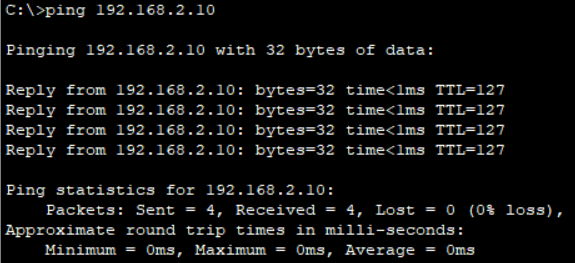
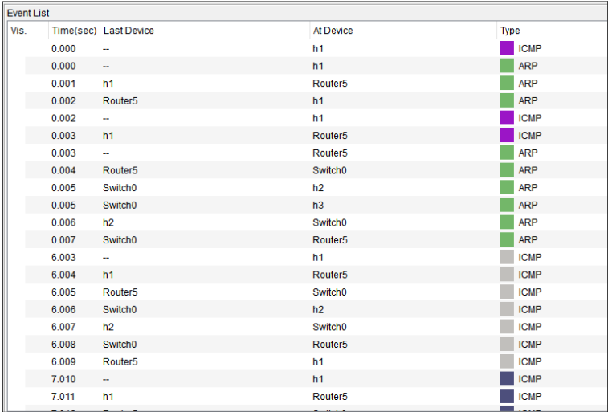

# Trabajo Práctico N°1: 
## Parte I - Configuración y Análisis de tráfico IPv4/IPv6

**Nombres**  
_Jorge A. Arbach_; _Bianca A. Fraga_;  _Sol A. Nou_; _Felipe Pillichody_.

**Grupo**: Rackea2  
**Universidad Nacional de Córdoba**  
**Redes de Computadoras**

**Profesores**:   Santiago Henn

**Fecha** 26/03/2025   

---

### Información de los autores
 
- **Información de contacto**: _jorge.arbach@mi.unc.edu.ar_; 
_bianca.fraga@mi.unc.edu.ar_;
_sol.nou@mi.unc.edu.ar_;
_felipe.pillichody@mi.unc.edu.ar_

---
## Resumen

En este informe se realiza la configuración y el análisis del modelo de red propuesto en el simulador Packet Tracer, implementando y evaluando el comportamiento de los protocolos IPv4 e IPv6. Se analizará el tráfico de red utilizando herramientas de captura y se estudiará el funcionamiento de ARP, NDP e ICMP en distintos escenarios de comunicación. 

**Palabras clave**: _IPv4, IPv6, ARP, NDP, ICMP, DHCP, Emuladores, Simuladores, Tráfico de Red_

---

## Introducción

Los sistemas de comunicación desempeñan un papel fundamental en la interconexión de dispositivos. Con el crecimiento exponencial de terminales conectadas, la transición de IPv4 a IPv6 se ha vuelto más y más común en los esquemas de las distintas redes. Este trabajo práctico tiene como objetivo ahondar en la configuración de redes dual stack, las cuales permiten que los dispositivos de red tengan soporte tanto para los protocolos IPv4 como para los protocolos IPv6.

A lo largo del informe, se realizarán pruebas de conectividad, se analizará el tráfico generado entre los diferentes hosts y se estudiarán los mecanismos de resolución de direcciones lógicas y físicas. Además, se explorará la diferencia entre emuladores y simuladores en el ámbito de interconexión de sistemas.

---

# Marco teórico

## Simulador y Emulador
Los simuladores y emuladores son herramientas utilizadas para replicar el comportamiento de sistemas en entornos controlados, aunque presentan diferencias claves. En redes, un simulador reproduce las condiciones de red de forma abstracta, permitiendo la creación de entornos con tráfico controlado y definido. No ejecuta el código real del sistema, sino una representación simplificada, ideal para pruebas en escenarios hipotéticos. 
Por otro lado, un emulador replica el sistema real a nivel de código y hardware. Ejecuta las mismas instrucciones que el sistema original, permitiendo un entorno de prueba más realista que simula mejor el funcionamiento de la red.

## Protocolos de Interconexión
IPv4 e IPv6 son los protocolos fundamentales para la comunicación en entornos TCP/IP. IPv4 utiliza direcciones de 32 bits, lo que permite un total de aproximadamente 4.3 mil millones de direcciones únicas. Debido al crecimeinto de las redes y el agotamiento de direcciones IPv4, se ha desarrollado IPv6, que usa direcciones de 128 bits, proporcionando un espacio de dirección prácticamente ilimitado. Este último también introduce mejoras en la estructura de paquetes, eliminando la fragmentación en los routers y mejorando la eficiencia del encaminamiento.

## Modelo OSI y Modelo TCP/IP
La comunicación en sistemas interconectados se basa en estos modelos, que establecen una arquitectura estratificada para el intercambio de datos. El modelo OSI se compone de siete capas (física, enlace de datos, red, transporte, sesión, presentación y aplicación), mientras que el modelo TCP/IP tiene cinco (física, acceso a la red, internet, transporte y aplicación). En ambos casos, las capas de red y transporte son esenciales para la transmisión de paquetes. 

## Encapsulamiento de Datos 
En el proceso de transmisión de información, los datos se encapsulan en distintas capas del modelo de referencia. En IPv6, se han eliminado algunos campos innecesarios de IPv4, lo que simplifica el procesamiento de paquetes y mejora la eficiencia en la red. Además, IPv6 introduce extensiones opcionales que permiten agregar funcionalidades sin afectar la estructura base del encabezado.

## Comando Ping
Ping es una utilidad de red que emplea el Protocolo de Mensajes de Control de Internet (ICMP) para verificar la conectividad entre dispositivos. Al enviar un paquete ICMP de solicitud de eco y recibir una respuesta, se mide el tiempo de ida y vuelta, evaluando la latencia y verificando la accesibilidad de un host.

## ICMP
ICMP o Internet Control Message Protocol, es un protocolo de diagnóstico utilizado para enviar mensajes de error y control entre dispositivos. Un ejemplo de esto es el ping. En la pila TCP/IP, ICMP opera en la capa de red (capa 3 en el modelo OSI) y usa PDUs tipo "mensaje".

## Protocolo ARP (Address Resolution Protocol)
ARP o Address Resolution Protocol le  permite a los dispositivos descubrir la dirección física (MAC) asociada a una dirección IP. Opera en la capa de enlace de datos (capa 2 OSI) y en la capa de red del modelo TCP/IP. Su PDU principal es la solicitud y respuesta ARP.

## Protocolo NDP (Neighbor Discovery Protocol)
En IPv6, NDP reemplaza a ARP y proporciona funcionalidades adicionales, como la detección de routers, la resolución de direcciones y la configuración automática de direcciones sin necesidad de un servidor DHCP en redes locales. También permite la detección de direcciones duplicadas y la redirección eficiente del tráfico en redes complejas

## Direcciones de Broadcast en IPv4 y MAC
La dirección IPv4 de broadcast, donde todos los bits de host se setean a uno, permite enviar un paquete a todos los dispositivos de una red local. A nivel de enlace, esto implica una dirección MAC Broadcast. La dirección MAC FF:FF:FF:FF:FF:FF permite el envío de mensajes a todos los dispositivos de la red.

## Direcciones de Multicast en IPv6
Las direcciones IPv6 multicast son similares a las direcciones IPv4 multicast. Estas direcciones multicast se utilizan para enviar un único paquete a uno o más destinos (grupo multicast). Las direcciones IPv6 multicast tienen el prefijo FF00::/8.

Algunas direcciones multicast en IPv6 están predefinidas para funciones específicas:

| Dirección         | Descripción |
|------------------|-------------|
| `FF02::1` | Todos los nodos en el enlace local. |
| `FF02::2` | Todos los enrutadores en el enlace local. |
| `FF02::5` | Grupo de routers OSPFv3. |
| `FF02::A` | Grupo de routers EIGRP. |
| `FF02::FB` | Servicio mDNS (Multicast DNS). |
| `FF05::101` | Grupo de servidores de tiempo NTP. |

# Resultados
Vamos a realizar un ping desde Cliente 1 hacia Cliente 2 para iniciar un tráfico ICMP y analizar el tráfico de la red, los mensajes y paquetes de la misma.

Se tomaron diversos mensajes para detectar el tráfico y la comunicación entre dispositivos en la red, analizando protocolos como ICMP y ARP, y documentando los tiempos de respuesta y rutas utilizadas en cada interacción.

