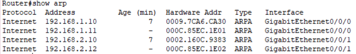

# Trabajo Práctico N°1: 
## Parte I - Configuración y Análisis de tráfico IPv4/IPv6

**Nombres**  
_Jorge A. Arbach_; _Bianca A. Fraga_;  _Sol A. Nou_; _Felipe Pillichody_.

**Grupo**: Rackea2  
**Universidad Nacional de Córdoba**  
**Redes de Computadoras**

**Profesores**:   Santiago Henn

**Fecha** 26/03/2025   

---

### Información de los autores
 
- **Información de contacto**: _jorge.arbach@mi.unc.edu.ar_; 
_bianca.fraga@mi.unc.edu.ar_;
_sol.nou@mi.unc.edu.ar_;
_felipe.pillichody@mi.unc.edu.ar_

---
## Resumen

En este informe se realiza la configuración y el análisis del modelo de red propuesto en el simulador Packet Tracer, implementando y evaluando el comportamiento de los protocolos IPv4 e IPv6. Se analizará el tráfico de red utilizando herramientas de captura y se estudiará el funcionamiento de ARP, NDP e ICMP en distintos escenarios de comunicación. 

**Palabras clave**: _IPv4, IPv6, ARP, NDP, ICMP, DHCP, Emuladores, Simuladores, Tráfico de Red_

---

## Introducción

Los sistemas de comunicación desempeñan un papel fundamental en la interconexión de dispositivos. Con el crecimiento exponencial de terminales conectadas, la transición de IPv4 a IPv6 se ha vuelto más y más común en los esquemas de las distintas redes. Este trabajo práctico tiene como objetivo ahondar en la configuración de redes dual stack, las cuales permiten que los dispositivos de red tengan soporte tanto para los protocolos IPv4 como para los protocolos IPv6.

A lo largo del informe, se realizarán pruebas de conectividad, se analizará el tráfico generado entre los diferentes hosts y se estudiarán los mecanismos de resolución de direcciones lógicas y físicas. Además, se explorará la diferencia entre emuladores y simuladores en el ámbito de interconexión de sistemas.

---

# Marco teórico

## Simulador y Emulador
Los simuladores y emuladores son herramientas utilizadas para replicar el comportamiento de sistemas en entornos controlados, aunque presentan diferencias claves. En redes, un simulador reproduce las condiciones de red de forma abstracta, permitiendo la creación de entornos con tráfico controlado y definido. No ejecuta el código real del sistema, sino una representación simplificada, ideal para pruebas en escenarios hipotéticos. 
Por otro lado, un emulador replica el sistema real a nivel de código y hardware. Ejecuta las mismas instrucciones que el sistema original, permitiendo un entorno de prueba más realista que simula mejor el funcionamiento de la red.

## Protocolos de Interconexión
IPv4 e IPv6 son los protocolos fundamentales para la comunicación en entornos TCP/IP. IPv4 utiliza direcciones de 32 bits, lo que permite un total de aproximadamente 4.3 mil millones de direcciones únicas. Debido al crecimeinto de las redes y el agotamiento de direcciones IPv4, se ha desarrollado IPv6, que usa direcciones de 128 bits, proporcionando un espacio de dirección prácticamente ilimitado. Este último también introduce mejoras en la estructura de paquetes, eliminando la fragmentación en los routers y mejorando la eficiencia del encaminamiento.

## Modelo OSI y Modelo TCP/IP
La comunicación en sistemas interconectados se basa en estos modelos, que establecen una arquitectura estratificada para el intercambio de datos. El modelo OSI se compone de siete capas (física, enlace de datos, red, transporte, sesión, presentación y aplicación), mientras que el modelo TCP/IP tiene cinco (física, acceso a la red, internet, transporte y aplicación). En ambos casos, las capas de red y transporte son esenciales para la transmisión de paquetes. 

## Encapsulamiento de Datos 
En el proceso de transmisión de información, los datos se encapsulan en distintas capas del modelo de referencia. En IPv6, se han eliminado algunos campos innecesarios de IPv4, lo que simplifica el procesamiento de paquetes y mejora la eficiencia en la red. Además, IPv6 introduce extensiones opcionales que permiten agregar funcionalidades sin afectar la estructura base del encabezado.

## Comando Ping
Ping es una utilidad de red que emplea el Protocolo de Mensajes de Control de Internet (ICMP) para verificar la conectividad entre dispositivos. Al enviar un paquete ICMP de solicitud de eco y recibir una respuesta, se mide el tiempo de ida y vuelta, evaluando la latencia y verificando la accesibilidad de un host.

## ICMP
ICMP o Internet Control Message Protocol, es un protocolo de diagnóstico utilizado para enviar mensajes de error y control entre dispositivos. Un ejemplo de esto es el ping. En la pila TCP/IP, ICMP opera en la capa de red (capa 3 en el modelo OSI) y usa PDUs tipo "mensaje".

## Protocolo ARP (Address Resolution Protocol)
ARP o Address Resolution Protocol le  permite a los dispositivos descubrir la dirección física (MAC) asociada a una dirección IP. Opera en la capa de enlace de datos (capa 2 OSI) y en la capa de red del modelo TCP/IP. Su PDU principal es la solicitud y respuesta ARP.

## Protocolo NDP (Neighbor Discovery Protocol)
En IPv6, NDP reemplaza a ARP y proporciona funcionalidades adicionales, como la detección de routers, la resolución de direcciones y la configuración automática de direcciones sin necesidad de un servidor DHCP en redes locales. También permite la detección de direcciones duplicadas y la redirección eficiente del tráfico en redes complejas

## Direcciones de Broadcast en IPv4 y MAC
La dirección IPv4 de broadcast, donde todos los bits de host se setean a uno, permite enviar un paquete a todos los dispositivos de una red local. A nivel de enlace, esto implica una dirección MAC Broadcast. La dirección MAC FF:FF:FF:FF:FF:FF permite el envío de mensajes a todos los dispositivos de la red.

## Direcciones de Multicast en IPv6
Las direcciones IPv6 multicast son similares a las direcciones IPv4 multicast. Estas direcciones multicast se utilizan para enviar un único paquete a uno o más destinos (grupo multicast). Las direcciones IPv6 multicast tienen el prefijo FF00::/8.

Algunas direcciones multicast en IPv6 están predefinidas para funciones específicas:

| Dirección         | Descripción |
|------------------|-------------|
| `FF02::1` | Todos los nodos en el enlace local. |
| `FF02::2` | Todos los enrutadores en el enlace local. |
| `FF02::5` | Grupo de routers OSPFv3. |
| `FF02::A` | Grupo de routers EIGRP. |
| `FF02::FB` | Servicio mDNS (Multicast DNS). |
| `FF05::101` | Grupo de servidores de tiempo NTP. |

# Resultados
Vamos a realizar un ping desde Cliente 1 hacia Cliente 2 para iniciar un tráfico ICMP y analizar el tráfico de la red, los mensajes y paquetes de la misma.

Se tomaron diversos mensajes para detectar el tráfico y la comunicación entre dispositivos en la red, analizando protocolos como ICMP y ARP, y documentando los tiempos de respuesta y rutas utilizadas en cada interacción.

En primer lugar, podemos identificar varias comunicaciones ARP, las cuales ocurren entre h1 y el router, así como entre el router y h2. 

El primer paso para realizar la comunicación entre h1 y h2 es el proceso de resolución ARP entre dichos hosts, el cual transforma las direcciones lógicas (IP) a físicas (MAC)

Cuando h1 desea enviar un paquete ICMP, que es el paquete que enviamos al realizar el comando ping a h2, primero debe conocer la dirección MAC del destino. Sin embargo, dado que h1 y h2 están en redes diferentes, la comunicación no puede ser directa y debe pasar a través del router, que actúa como intermediario. Este proceso involucra múltiples intercambios ARP tal como lo evidenciamos en la figura 3:

#### 1. Descubrimiento de la dirección MAC del router
Antes de enviar el paquete ICMP, h1 debe determinar la dirección MAC de su puerta de enlace predeterminada **(192.168.1.11)**. Para ello, envía una **solicitud ARP** en broadcast (MAC de destino: `FF:FF:FF:FF:FF:FF`)

- **Origen MAC:** `00:11:22:33:44:55` (h1)  
- **Destino MAC:** `FF:FF:FF:FF:FF:FF` (broadcast)  
- **Origen IP:** `192.168.1.10`  
- **Destino IP:** `192.168.1.11`  

El router, al recibir esta solicitud, responde con un **ARP Reply**, enviando su dirección MAC directamente a h1.  

- **Origen MAC:** `00:AA:BB:CC:DD:11` (Router)  
- **Destino MAC:** `00:11:22:33:44:55` (h1)  
- **Origen IP:** `192.168.1.11`  
- **Destino IP:** `192.168.1.10`  

A partir de este momento, h1 almacena en su **tabla ARP** la correspondencia entre la IP del router (`192.168.1.11`) y su dirección MAC (`00:AA:BB:CC:DD:11`), permitiéndole enviar los paquetes ICMP correctamente.

#### 2. Descubrimiento de la dirección MAC de h2
Cuando el router recibe el paquete ICMP de h1, verifica su tabla de enrutamiento y determina que el destino (192.168.2.11) pertenece a una red diferente (192.168.2.0/24). Antes de reenviar el paquete a h2, el router necesita conocer su dirección MAC. Para ello, emite otra **solicitud ARP (ARP Request)** en la segunda red.  

- **Origen MAC:** `00:AA:BB:CC:DD:22` (Router, interfaz en red 192.168.2.0/24)  
- **Destino MAC:** `FF:FF:FF:FF:FF:FF` (broadcast)  
- **Origen IP:** `192.168.2.12`  
- **Destino IP:** `192.168.2.11`  

Este paquete pasa por el switch, el cual reenvía la trama Ethernet dentro de la red, como veremos más adelante, y luego h2 responde con un **ARP Reply**, enviando su dirección MAC al router:

- **Origen MAC:** `00:66:77:88:99:AA` (h2)  
- **Destino MAC:** `00:AA:BB:CC:DD:22` (Router)  
- **Origen IP:** `192.168.2.11`  
- **Destino IP:** `192.168.2.12`  

Con esta información, el router actualiza su **tabla ARP** y puede reenviar el paquete ICMP hacia h2. Finalmente, h2 procesa la solicitud y responde al ping de h1, siguiendo el mismo proceso de manera inversa.

Las direcciones IP en los paquetes ICMP reflejan el origen y destino de la comunicación.
Si analizamos el paquete ICMP enviado de h1, podemos observar como este contiene en su datagrama la dirección IP de origen (192.168.1.10), correspondiente a él mismo, y la dirección IP de destino (192.168.2.10), correspondiente a h2 que se encuentra en la otra subred. 

El router usa su tabla de rutas para decidir por dónde enviar los paquetes. Como h1 y h2 están en redes diferentes, el router debe realizar el proceso mencionado en el punto a).

Cuando el router recibe el paquete proveniente de h1, analiza la dirección IP de destino correspondiente a h2 (192.168.2.10) y revisa su tabla de enrutamiento para determinar la interfaz de salida, la cual en este caso es la correspondiente a la red 192.168.2.0/24 que se encuentra en la interfaz eth1.

Como desarrollamos anteriormente el router necesita conocer la dirección MAC de h2 para enviar el paquete. Si no la tiene en su tabla ARP, realiza el mismo proceso de **ARP request** y **ARP reply**, completa la tabla y envía el paquete.

Finalmente, h2 recibe el paquete ICMP, lo procesa y envía una respuesta siguiendo el mismo proceso en reversa.

Como podemos observar en la figura 8, el router ha resuelto las direcciones IP en direcciones MAC que han sido necesarias para realizar la comunicación entre h1 y h2. Situándonos en el router, se aprecian las siguientes direcciones:
* `192.168.1.10` corresponde a la dirección IP de h1 que ha sido traducida a la dirección física, correspondiente a la MAC _0009.7CA6.CA30_
* `192.168.1.11` corresponde a la dirección IP de la puerta de enlace de la interfaz GigabitEthernet0//0/0 (eth0) del mismo router.
* `192.168.2.10` corresponde a la dirección IP de h2 que ha sido traducida a la dirección física, correspondiente a la MAC _0002.160C.9383_
* `192.168.2.12` corresponde a la dirección IP de la puerta de enlace de la interfaz GigabitEthernet0//0/1 (eth1) del mismo router.

En relación a este trabajo práctico, el switch permite que exista una comunicación entre los dispositivos que se encuentran conectados a él a través de sus interfaces, tal es el caso de h1, h2 y h3. El router también está conectado a dicho switch para facilitar la comunicación entre las distintas subredes que se pueden llegar a tener. Lo único que hace es pasar los datos entre los hosts y el router sin la necesidad de tener que procesar las direcciones IP. 

No tiene asignado direcciones IP en sus interfaces debido a que el switch opera en la capa de enlace de datos. Esto implica que no es necesario para el cumplimiento de su función principal de conmutación. Esto significa que los switches trabajan únicamente con direcciones MAC, que son identificadores únicos asociados a las tarjetas de red de los dispositivos conectados. 

Así como el switch mantiene una tabla de las direcciones MAC, los dispositivos hosts también tienen una tabla de direcciones, llamada ARP. En la tabla ARP de h1 se lista la dirección IP del dispositivo, la dirección física MAC asociada a tal IP y una columna Type: dynamic.

Esta tabla significa que h1 tiene registrada una asociación “dinámica” entre una dirección IP y su correspondiente dirección MAC. Se dice que es de este tipo debido al funcionamiento del protocolo ARP, el cuál genera estas asociaciones de manera automática cuando h1 necesita comunicarse con un dispositivo específico dentro de la red local. 

A su vez, la tabla ARP de h2 contiene la dirección IP y MAC de la interfaz eth1, que direcciona del router a los hosts:

Esto significa que h2 tiene una asociación dinámica registrada entre la dirección IP y la dirección MAC. Esta entrada fue generada automáticamente cuando h2 necesitó comunicarse con la interfaz del router (eth1), que conecta la subred de h2 con otros dispositivos o redes. ARP crea estas asociaciones automáticamente para permitir que los paquetes lleguen al dispositivo correcto dentro de la red local.

A comparación de h2, donde podemos observar contenido dentro de la tabla ARP, podemos notar que h3 posee una tabla vacía debido a que no se ha realizado ninguna comunicación entre Cliente y Cliente. 

Por otro lado, la tabla ARP del Router contiene las direcciones IP y MAC correspondientes a todas sus interfaces, tanto eth0 como eth1. En dicha tabla se registran no solo las entradas propias de las interfaces, sino también las direcciones de los hosts con los que el router ha establecido comunicación en sus respectivas subredes.

Debido a la falta de comunicación, el dispositivo h3 aún no se encuentra registrado en la tabla ARP de la interfaz eth1.

