# Parte II - Manejo de equipamiento físico, recuperación de contraseñas de equipos de red y establecimiento de red y análisis de tráfico.

## Introducción

En esta parte del informe se documenta el proceso de configuración y monitoreo de un switch Cisco, abarcando desde la conexión inicial hasta el análisis del tráfico de red. Se llevaron a cabo diversas pruebas en un entorno real, con el objetivo de afianzar los conocimientos sobre administración de redes y protocolos de comunicación.

Las actividades realizadas incluyen la conexión de una PC al puerto de consola del switch mediante PuTTY, la configuración de credenciales de acceso, la asignación de direcciones IP a los equipos conectados y la verificación de conectividad mediante ping. Además, se implementó el port mirroring para capturar y analizar paquetes con Wireshark, permitiendo la observación del tráfico generado entre dispositivos y la identificación de los datos encapsulados en el protocolo TCP.

Este trabajo continua con lo visto en la parte 1 y proporciona una visión práctica sobre la administración y monitoreo de redes, enfatizando en la correcta configuración de dispositivos para garantizar un funcionamiento óptimo.

---

## Resultado

En primer lugar, se busca adquirir un conocimiento profundo sobre el switch. Para ello, se usaron recursos como la hoja de datos e información técnica del dispositivo, para poder describir al switch de manera detallada, sus especificaciones y características.

Se trabajó con un switch de la serie Switch CISCO 2950. Esta es una serie de switches independientes de configuración fija, gestionables a 10/100 Mbps para proporcionar conectividad de usuarios para redes pequeñas y medianas con velocidad de cable y funcionalidad Cisco IOS para uso de datos, video y voz. Todos los switches de la serie llevan embebido el software de administrador de dispositivos Cisco que permite configurarlo y controlarlo a través de navegador web estándar.

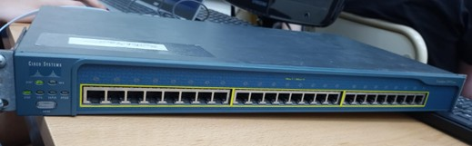

**Especificaciones**
- Dimensiones: 44,4 cm x 24,1 cm x 4,3 cm  (ancho x Profundidad x Altura). Su peso es de unos 3 kg.
- Modelos: Cisco Catalyst 2950-12, 2950-24, 2950-48.
- Puertos Ethernet: 12, 24 o 48 puertos 10/100 Mbps y 2 puertos fijos de enlace ascendente.
- Compatibilidad: compatible con la migración a Gigabit Ethernet a través de medios de cobre en la capa de acceso.

**Anatomía y paneles**
- Indicadores LED: muestran el estado de conexión, velocidad y actividad de los puertos. Un LED verde generalmente significa que el puerto está en funcionamiento. 
- Paneles Frontales: incluyen indicadores LED para el estado de los puertos, energía y enlace. Los LEDs de enlace y actividad muestran si hay una conexión activa y si hay tráfico de datos en el puerto. Parpadean cuando se envían o reciben datos. 
- Interfaces: puertos Ethernet para conexiones de red (10/100 Mbps - Uplink Gigabit Ethernet), puertos de administración (Puerto de Consola - Puerto Auxiliar) y puertos de alimentación (Conexión de Energía). 

**Funciones**
- Conectividad: proporciona conectividad de red de alta velocidad con soporte para Fast Ethernet y Gigabit Ethernet.
- Gestión: configuración y gestión a través de la CLI (Command Line Interface) de Cisco.
- Redundancia de energía: compatible con sistemas de alimentación redundante opcionales, proporcionando una mayor fiabilidad en entornos críticos. Esto nos permite, entre otras cosas, continuidad del servicio, seguridad y fiabilidad, y facilidad de implementación. 
- Prioridades de tráfico: soporte para cuatro colas de salida, permitiendo la asignación de propiedades para diferentes aplicaciones en la LAN. Esto se conoce como Calidad de Servicio (QoS), y es esencial para gestionar eficazmente el rendimiento de la red. Algunos beneficios de esta función son la optimización del ancho de banda, gestión de tráfico eficiente, y configuración flexible. 

**Software y gestión**
- Cisco Device Manager: software embebido que permite configurar y monitorear el switch a través de un navegador web estándar.
- Cisco Network Assistant: aplicación de gestión de red que simplifica la administración de redes pequeñas y medianas. 

Para realizar la configuración de este switch de Cisco y realizar los procedimientos requeridos para trabajar con el mismo, se ha desarrollado una checklist, en la cual se ejecutan paso por paso los comandos y acciones necesarias para lograr dicho objetivo

###Conectar una PC al puerto de consola del switch Cisco a 9600 baudios utilizando PUTTY

1. Reunir materiales:
- [x] Cable de consola - RJ45 a DB9
- [x] Adaptador USB a Serial
- [x] Notebook con Windows en nuestro caso
- [x] Software PuTTY

2. Conectar el cable de consola:
- [x] Conectar el extremo RJ45 al puerto de consola del switch y extremo USB a la Notebook
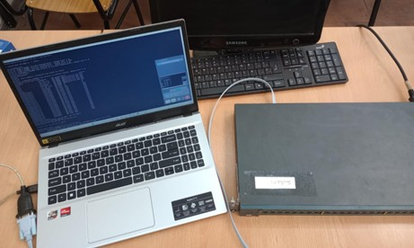
- [x] Abrir PuTTY y configurar la conexión para acceder a la CLI
- Conexión Serie
- Port: COMx, según corresponda
- Speed: 9600.

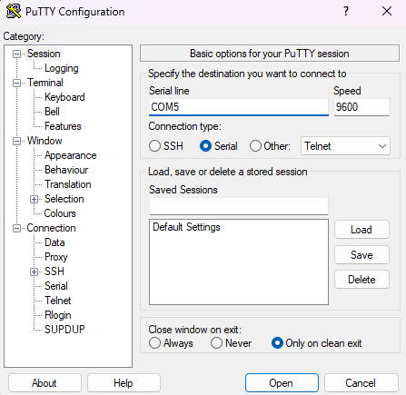

###Acceder a las opciones de administración del switch y modificar claves de acceso

1. Configurar contraseña de acceso al modo privilegiado
- [x] Entrar al modo de usuario privilegiado (> enable)
- [x] Entrar en el modo de configuración global (> configure terminal)
- [x] Configurar contraseña de acceso al modo privilegiado (> enable secret …)

2. Configurar contraseñas de acceso a la consola
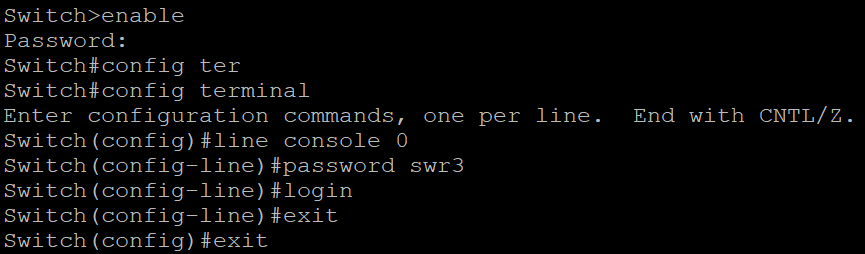

###Conectar dos computadoras al switch, configurar una red y testear conectividad

1. Conectar las computadoras a los puertos del switch con los cables Ethernet.
- [x] PC1: puerto Fa0/22.
- [x] PC2: puerto Fa0/24.
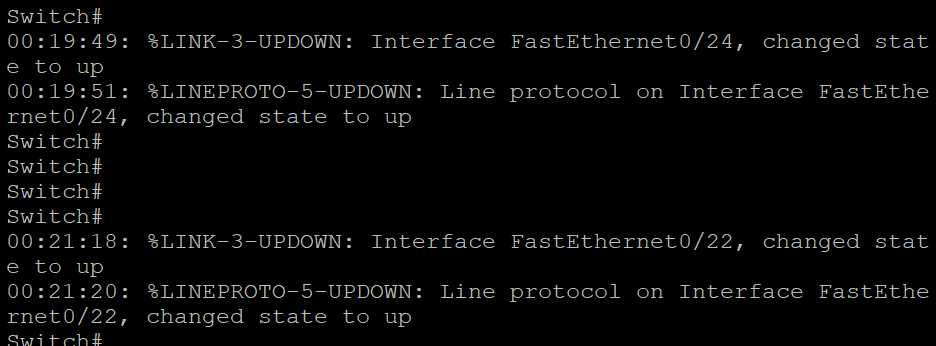

2. Configurar direcciones IP estáticas en las dos computadoras:
- [x] PC1: 192.168.1.10, Máscara: 255.255.255.0 
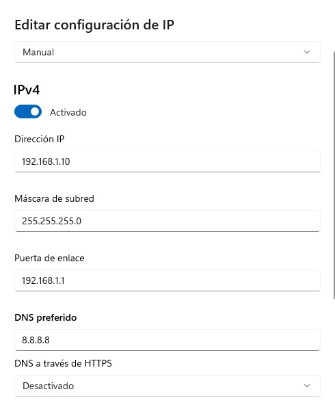
- [x] PC2: 192.168.1.11, Máscara: 255.255.255.0 
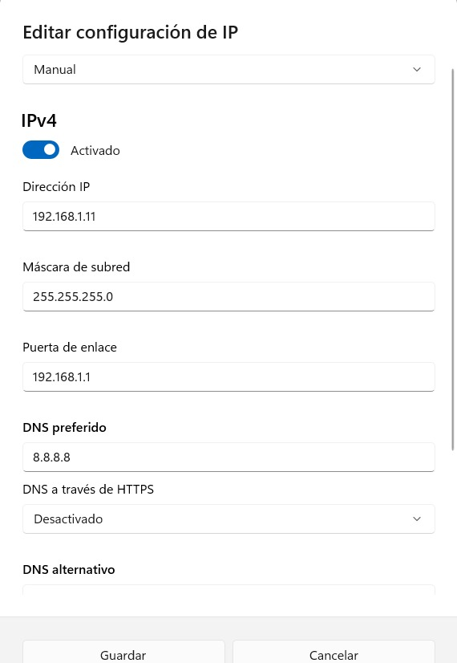

3. Verificar la configuración de red en cada PC
- [x] Deshabilitar firewall para permitir ICMP y TCP (que se verá mas adelante)
- [x] Ejecutar ipconfig para confirmar configuración IP.
- [x] Probar la conectividad con ping
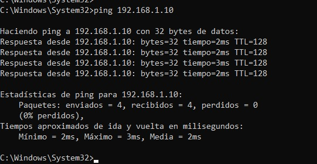

###Configurar un puerto del switch en modo mirroring y monitorear tráfico

1. Conectar otra computadora al switch.
- [x] PC3: puerto Fa0/23.

2. Configurar port mirroring en el switch:
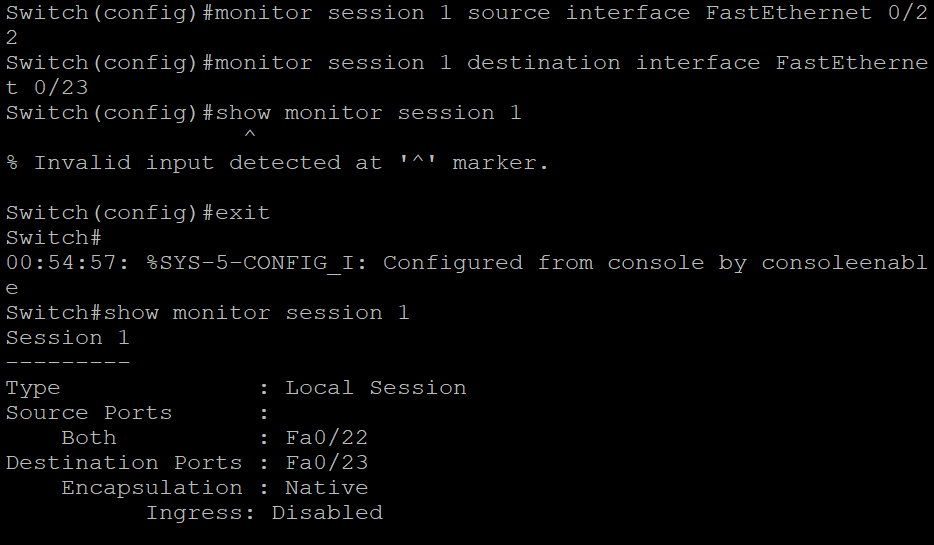

3. Configurar la tercera PC con software de captura de paquetes
- [x] Instalar y ejecutar Wireshark.
- [x] Seleccionar la interfaz de red de Ethernet 
- [x] Iniciar la captura

4. Ejecutar pruebas de conectividad mientras se monitorea
- [x] Filtrar en PC3 tráfico ICMP
- [x] Realizar ping entre PC1 y PC2. 
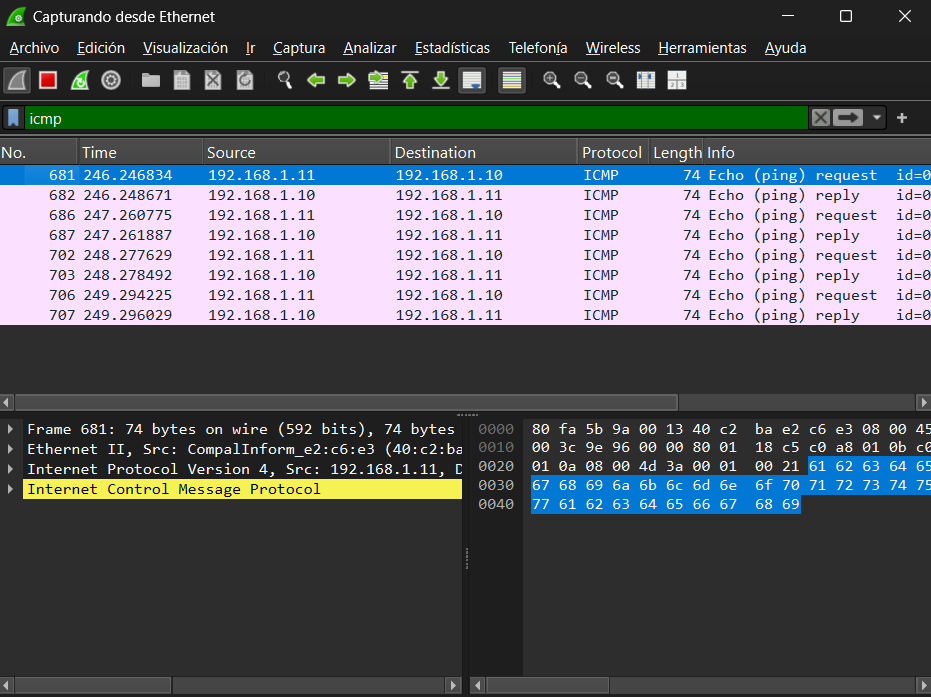

###Transmitir mensaje entre las computadoras y analizar el tráfico

1. Configurar PC1 como servidor
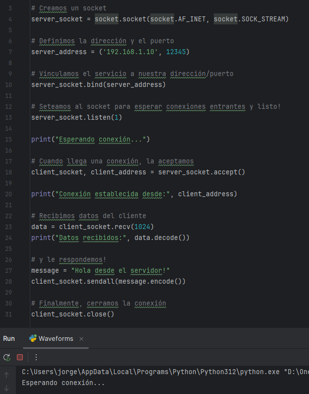

2. Ejecutar nuevas pruebas de conectividad mientras se monitorea
- [x] Filtrar en PC3 tráfico TCP
- [x] Envío de Paquete desde PC2 
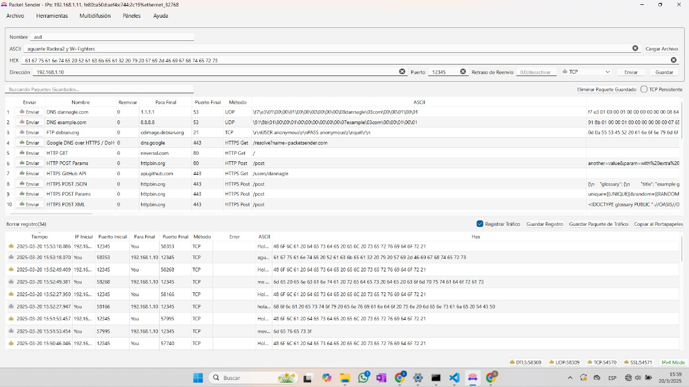
- [x] Capturamos el tráfico. 
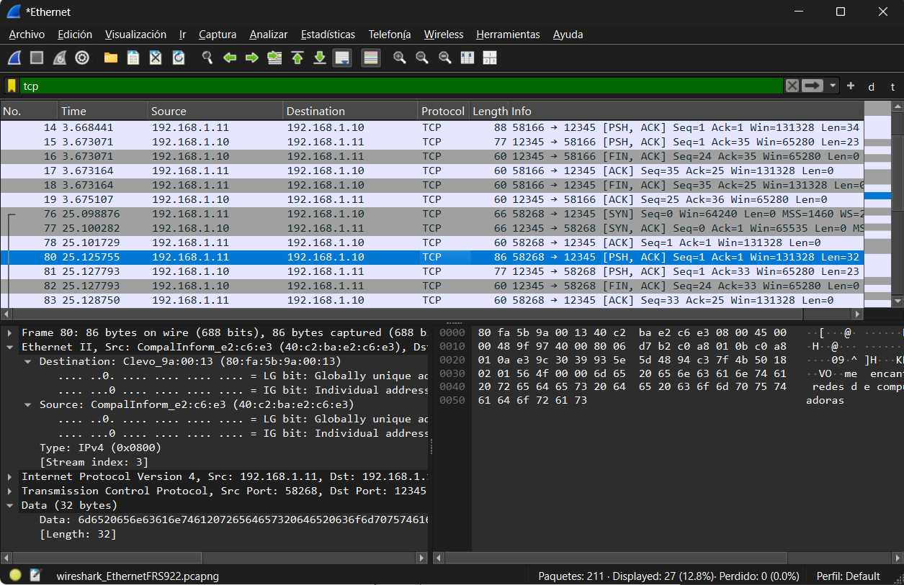
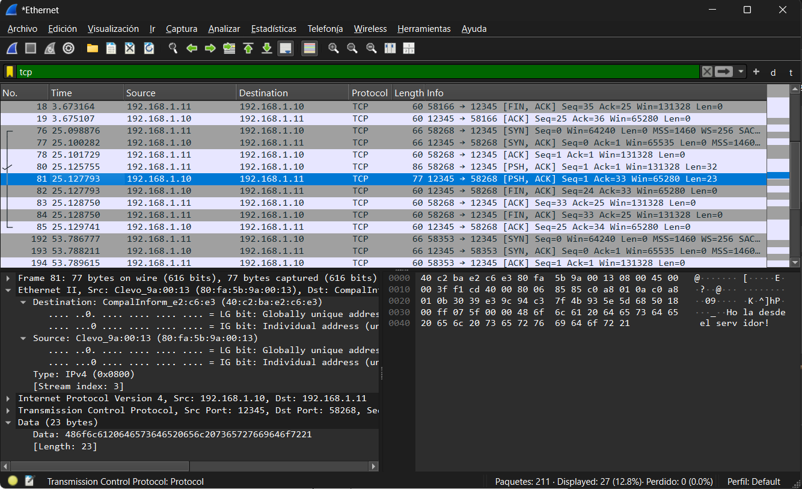

Una vez enviado el mensaje, en términos de encapsulación,el mismo viaja dentro de la sección de datos del segmento TCP, que a su vez está dentro del paquete IP, y finalmente dentro de la trama Ethernet. ya que hemos capturado dicho paquete por la computadora conectada al puerto de mirroring, podemos analizar cómo dicho mensaje se encapsula en el segmento TCP:

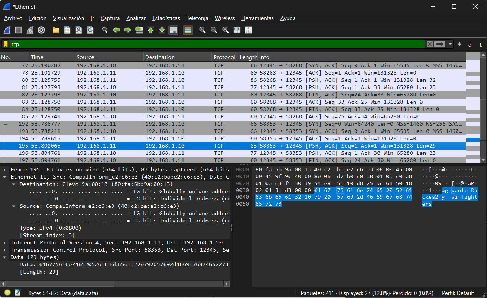

### Encapsulación del paquete
1. **Ethernet II Header**
- Dirección MAC de origen: `40:c2:ba:e2:c6:e3`
- Dirección MAC de destino: `80:fa:5b:9a:00:13`
- Tipo de protocolo: `0x0800` (IPv4)

2. **Encabezado IPv4**
- Dirección IP de origen: `192.168.1.11`
- Dirección IP de destino: `192.168.1.10`
- Protocolo: `TCP (0x06)`

3. **Encabezado TCP**
- Puerto de origen: `58353` 
- Puerto de destino: `12345`
- Flags: `PSH, ACK`
- Número de secuencia: `1`
- Número de acuse de recibo: `1`
- Tamaño de ventana: `131328`

4. **Datos (Payload)**
Tenemos el mensaje enviado: “aguante Rackea2 y Wi-Figthers”, que se convierte a ASCII con sus valores hexadecimales correspondientes:
- `61 67 75 61 6e 74 65 20 52 61 63 6b 65 61 32 20 79 20 57 69 2d 46 69 67 74 68 65 72 73`

A su vez podemos analizar las comunicaciones ARP que se observan en este tráfico capturado:
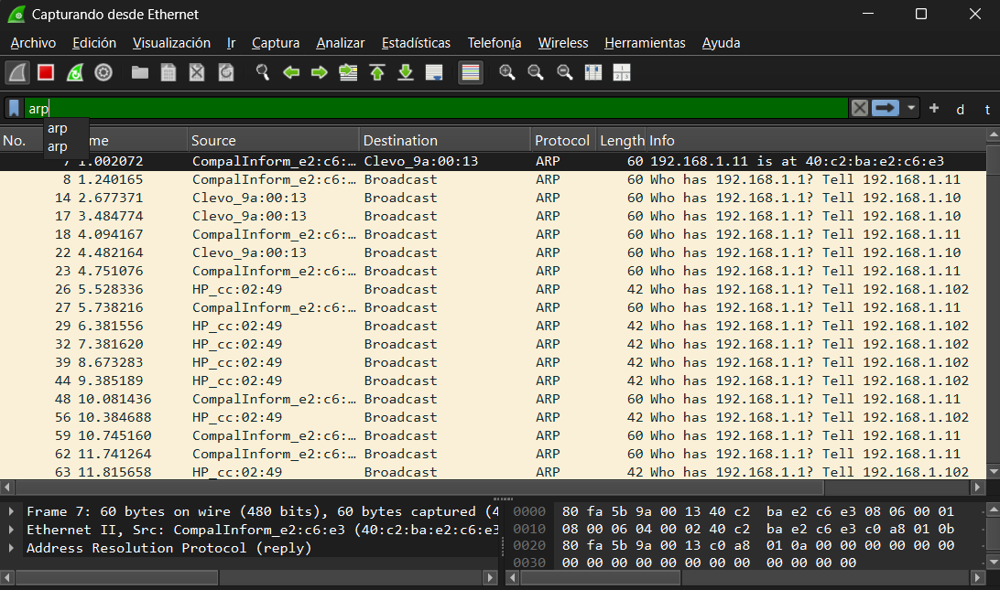

En la captura proporcionada se pueden observar paquetes de ARP con solicitudes y respuestas típicas, tales como:  
- **Solicitud ARP (“Who has”):** Cuando un dispositivo necesita comunicarse con otro en la misma red local, pero no conoce su dirección MAC, envía un mensaje de broadcast a todos los dispositivos de la red preguntando: “Quién tiene la dirección IP [IP destino]? Por favor, responde a [IP origen]”. Este mensaje se envía a la dirección MAC de broadcast. 
- **Respuesta ARP (“is at”):** El dispositivo que posee la dirección IP solicitada responde de manera directa al emisor del mensaje, informando: “[IP destino] está en [dirección MAC]”. Esto permite al dispositivo solicitante conocer la dirección física (MAC) para establecer la comunicación.

Además, podemos observar otro tipo de información que se encuentra en las respectivas columnas, por ejemplo:

- **Source (origen):** Dirección MAC del dispositivo que responde.
- **Destination (destino):** Dirección MAC del dispositivo que hizo la solicitud.
- **Cacheo ARP:** El dispositivo solicitante guarda la asociación IP-MAC en su tabla ARP para usarla en futuras comunicaciones.

Además, podemos analizar las direcciones IP en los datagramas:

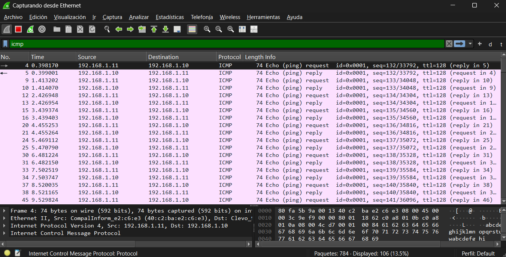
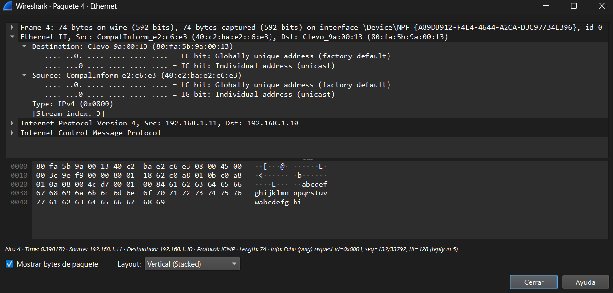

Las direcciones IP que aparecen en la imagen capturada son las de origen y destino, dependiendo de quién inicia la comunicación y quién la recibe. Por ejemplo:

- **Dirección IP de origen:** Es la IP del dispositivo que está enviando el datagrama. Sirve para identificar al remitente en la comunicación. 
En esta imagen se puede observar como **IP de origen: 192.168.1.11 (el Cliente 1 que envía la solicitud ICMP)**.

- **Dirección IP de destino:** Es la IP del dispositivo receptor, al que se dirige el datagrama. 
En esta imagen se puede observar como **IP de destino: 192.168.1.10 (el Cliente 2 que recibe y debe responder)**.

1. En el caso de una solicitud ICMP:
El datagrama enviado puede contener información como por ejemplo:

- **Tipo de mensaje:** Solicitud de eco. 
- **Código:** Identifica más detalles del mensaje ICMP.
- **Campo de datos:** Es el contenido que se desea enviar en el mensaje.

2. En el caso de una respuesta ICMP:
Cuando el Cliente 2 responde al Cliente 1, el datagrama cambia:

- **IP de origen:** Ahora es 192.168.1.10 (el Cliente 2 responde). 
- **IP de destino:** Vuelve a ser 192.168.1.11 (el Cliente 1 que originó la solicitud).
- **Tipo de mensaje:** Respuesta de eco.

Estas direcciones IP son esenciales para verificar la conectividad entre dispositivos, identificar problemas de configuración o redes, y analizar el comportamiento del tráfico. Con las capturas de herramientas como Wireshark, podemos confirmar que los mensajes están viajando correctamente entre los dispositivos en la red.

---

## Discusión y conclusiones
La implementación y análisis de la configuración del switch Cisco permitieron afianzar conceptos clave sobre redes, desde la interacción con la CLI hasta la captura y análisis de los paquetes. La utilización de Packet Tracer como herramienta de simulación fue útil para planificar las configuraciones antes de su aplicación en un entorno real.

La prueba de conectividad entre dispositivos y el análisis con Wireshark demostraron la encapsulación de los datos en los diferentes niveles de la pila de protocolos, proporcionando una comprensión más profunda sobre el funcionamiento de TCP/IP. En particular, la observación del mensaje transmitido en hexadecimal permitió evidenciar cómo la información es transportada y reconstruida en la comunicación de red.

## Referencias

[1] Cisco Systems. (2003). Cisco Catalyst 2950 Series Switches Installation Guide (Rev. B0). Cisco. https://teamkci.com/wp-content/uploads/WS-C2950.pdf 
