## Resultados

En primer lugar se configuraron manualmente las direcciones IP en los dispositivos participantes. Cada grupo de trabajo cuenta con su propia red local. Dentro de cada red, los dispositivos (PCs) están conectados a un mismo switch, el cual a su vez se conecta a un router que actúa como puerta de enlace hacia otras redes.

En una primera instancia, la red consistió en 2 computadoras del mismo grupo conectadas a un switch mediante la interfaz fastEthernet, las cuales interactúan entre sí.

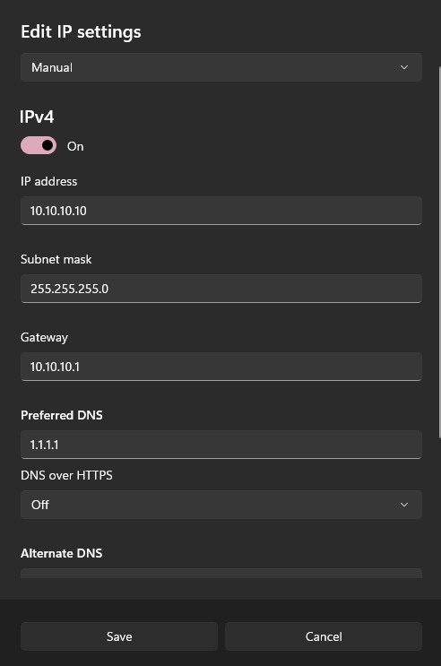
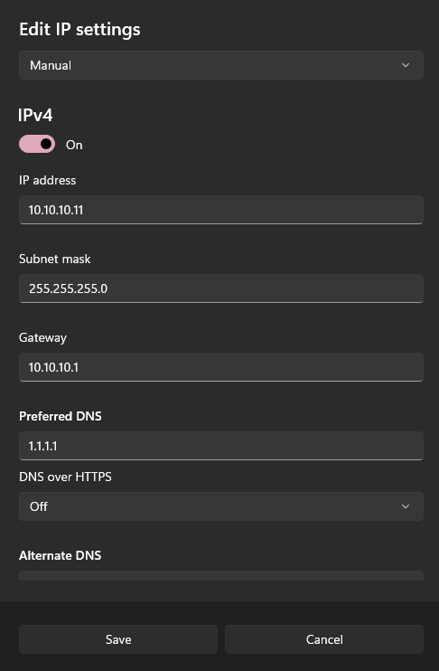

Una vez conectadas, mediante el cable UTP, se verificó la conectividad mediante comandos ICMP (ping) entre los hosts del mismo grupo.
**Ejemplo de ping entre PCs del mismo grupo:**

```bash
ping 10.10.10.10
ping 10.10.10.11
```

.png)
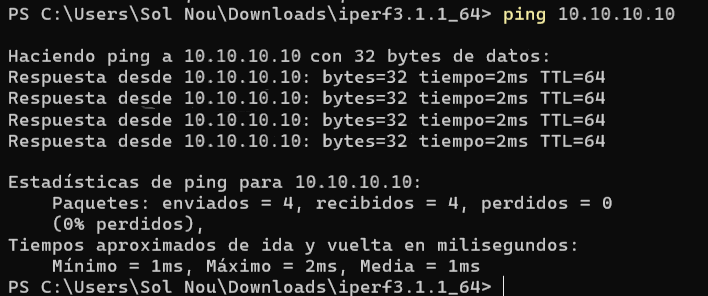

Como se puede observar, nuestro grupo se configuró en la red 10.10.10.x. La propuesta de direccionamiento por grupo planteada es:

| GRUPO | DISPOSITIVO | SUBRED          | IPV4         |
|-------|-------------|------------------|--------------|
| 0     | PC0         | 10.10.10.0/24    | 10.10.10.10  |
|       | PC1         | 10.10.10.0/24    | 10.10.10.11  |
| 1     | PC2         | 10.10.11.0/24    | 10.10.11.2   |
|       | PC3         | 10.10.11.0/24    | 10.10.11.3   |
| 2     | PC4         | 10.10.12.0/24    | 10.10.12.16  |
|       | PC5         | 10.10.12.0/24    | 10.10.12.17  |

Para probar conectividad con dispositivos de otros grupos, tenemos que tener en cuenta que estos pertenecen a redes diferentes, por lo que los paquetes que se mandan de una PC a otra en otro grupo deben ser encaminados por los routers. Esta parte no pudo ser realizada en laboratorio, por lo que fue simulada para entender a fondo la topología planteada. 

Para permitir esta comunicación entre routers, es necesario configurar interfaces con direcciones IP que pertenezcan a subredes distintas. Para estos enlaces se utilizan subredes /30, ya que solo se requiere una dirección IP para cada extremo de la conexión punto a punto. La propuesta de direccionamiento de interfaces de los routers planteada fue:

| DISPOSITIVO | INTERFAZ |   LINK HACIA          |  SUBRED           | IPV4        |
|-------------|----------|------------------|-------------|-------------|
| R0          | G0/0     | S0         | 10.10.10.0/24  | 10.10.10.1  |
|             | G0/1     | R1         | 172.16.1.0/30  | 172.16.1.1  |
|             | G0/2     | R2         | 172.16.1.4/30  | 172.16.1.5  |
| R1          | G0/0     | R0         | 172.16.1.0/30  | 172.16.1.2  |
|             | G0/1     | S1         | 10.10.11.0/24  | 10.10.11.1  |
|             | G0/2     | R2         | 172.16.1.8/30  | 172.16.1.9  |
| R2          | G0/0     | R0         | 172.16.1.4/30  | 172.16.1.6  |
|             | G0/1     | R1         | 172.16.1.8/30  | 172.16.1.10 |
|             | G0/2     | S2         | 10.10.12.0/24  | 10.10.12.1  |

Además de las IP asignadas a cada host, es importante que cada dispositivo debe tener como gateway la dirección IP de la interfaz que conecta al switch de su grupo.

En cada PC se asignó una dirección IP fija, junto con su máscara de subred y default gateway, de acuerdo al grupo al que pertenece. Ejemplo de la configuración en una de ellas:

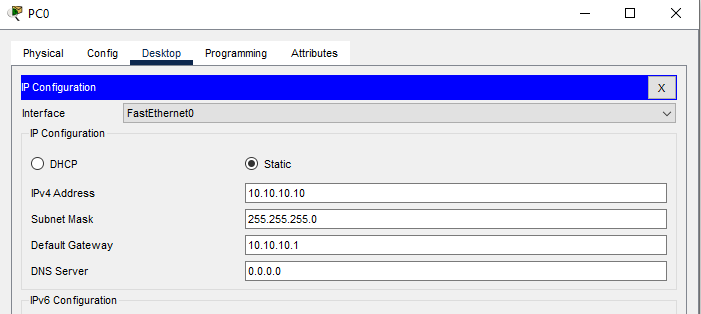

En los routers, la configuración se realizó mediante línea de comandos. Se habilitaron las interfaces necesarias y se les asignaron las direcciones IP correspondientes a cada subred, según el esquema previamente definido. Ejemplo de uno de los routers:

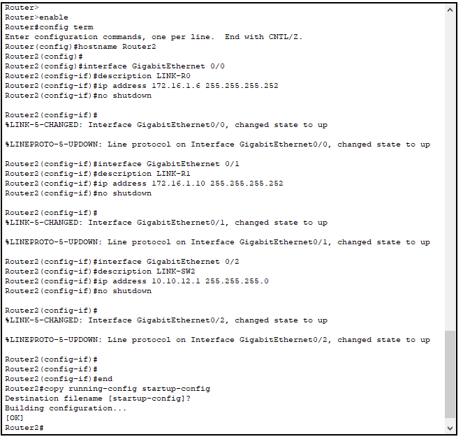

Con esta configuración básica, se procedió a realizar pruebas de conectividad mediante el envío de mensajes ICMP (ping) entre distintos dispositivos de la red. Los resultados fueron:

- Entre computadoras de una misma subred, la comunicación fue exitosa, lo que confirma que la configuración IP local y la conexión a través del switch están correctamente establecidas. Ej de ping desde PC0 hacia PC1:

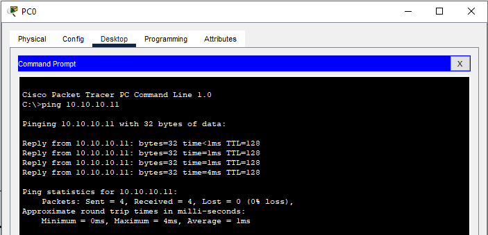

- Entre computadoras de diferentes subredes, los intentos de ping fallaron. Esto se debe a que, si bien los routers ya tienen sus interfaces configuradas, aún no se han definido las rutas estáticas que les permitan reenviar paquetes hacia redes que no conocen directamente. Al hacer ping de PC0 a PC2 ocurre:

	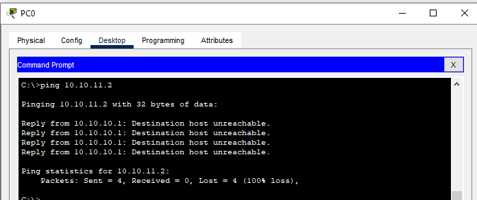

Para lograr la comunicación completa entre todas las PCs de la topología, es necesario establecer un esquema de ruteo estático que indique a cada router por qué interfaz debe enviar los paquetes destinados a cada red. Esto se hace por terminal, desde cada router, especificando 

``` bash
ip route RED_DESTINO MASCARA IP_DEL_SIGUIENTE_SALTO
```

Ej de aplicación, sobre el router 2:

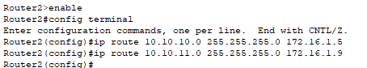

Con esto le estamos indicando, en la primera linea, que si el R2 recibe un paquete con destino a la red del grupo 0 (10.10.10.0/24), debe enviarlo al siguiente salto, que es la IP 172.16.1.5, correspondiente a la interfaz del Router0 que apunta hacia donde estamos, Router2.

Con las rutas ya definidas en cada router probamos nuevamente conexión entre PC0 (grupo 0) y PC2 (grupo 1) y obtenemos:

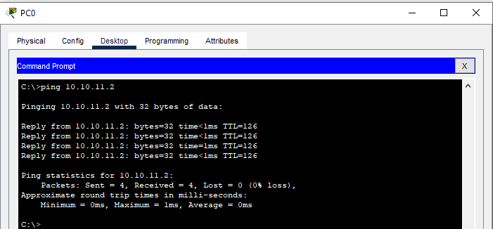

De esta forma finalizamos la simulación de la primera etapa, para garantizar que todos los hosts de las distintas redes puedan establecer comunicación entre ellos. 

Para continuar, dejamos atrás la simulación para volver al laboratorio. En esta etapa, descargamos la herramienta iPerf3 para realizar pruebas de rendimiento de la red desde su sitio oficial: [iperf.fr](https://iperf.fr). 

Antes de mostrar el uso de la misma, se van a resumir los principales comandos para realizar dichas pruebas de rendimiento. Esta herramienta permite medir la calidad de la conexión mediante pruebas configuradas por distintos protocolos, tamaños de paquetes, frecuencia y ancho de banda.

Para ejecutar pruebas de rendimiento de red, iPerf3 usa un modo cliente-servidor:  
- Un dispositivo actúa como **servidor** (`iperf3 -s`).  
- Otro dispositivo se conecta como **cliente** (`iperf3 -c <IP_DEL_SERVIDOR>`).  

### 1. Protocolo TCP y UDP
- **TCP** (por defecto):  
  ```sh
  iperf3 -c <IP_SERVIDOR>
  ```
- **UDP**:  
  ```sh
  iperf3 -c <IP_SERVIDOR> -u
  ```


### 2. Número y tamaño de paquetes 
- **Especificar el tamaño de los paquetes (solo UDP)** (ej: 1400 bytes):  
  ```sh
  iperf3 -c <IP_SERVIDOR> -u -l 1400
  ```
- **Número de flujos simultáneos (hilos)** (ej: 4 flujos):  
  ```sh
  iperf3 -c <IP_SERVIDOR> -P 4
  ```


### 3. Frecuencia/Tiempo
- **Duración de la prueba** (ej: 30 segundos):  
  ```sh
  iperf3 -c <IP_SERVIDOR> -t 30
  ```
- **Intervalo de reporte (ej: cada 2 segundos)**:  
  ```sh
  iperf3 -c <IP_SERVIDOR> -i 2
  ```


### 4. Ancho de banda
- **Limitar el ancho de banda** (ej: 5 Mbps en UDP):  
  ```sh
  iperf3 -c <IP_SERVIDOR> -u -b 5M
  ```
- **Modo reverso (el servidor envía datos al cliente)**:  
  ```sh
  iperf3 -c <IP_SERVIDOR> -R
  ```

Una vez conocido el funcionamiento de dicha herramienta, se procede a configurar Wireshark  para capturar y analizar el tráfico generado durante las pruebas con la herramienta iPerf3.

### Protocolo TCP
**Servidor:**

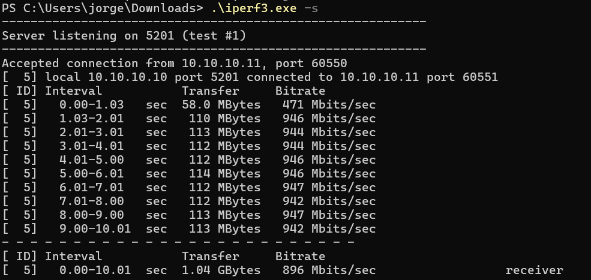

**Cliente:**

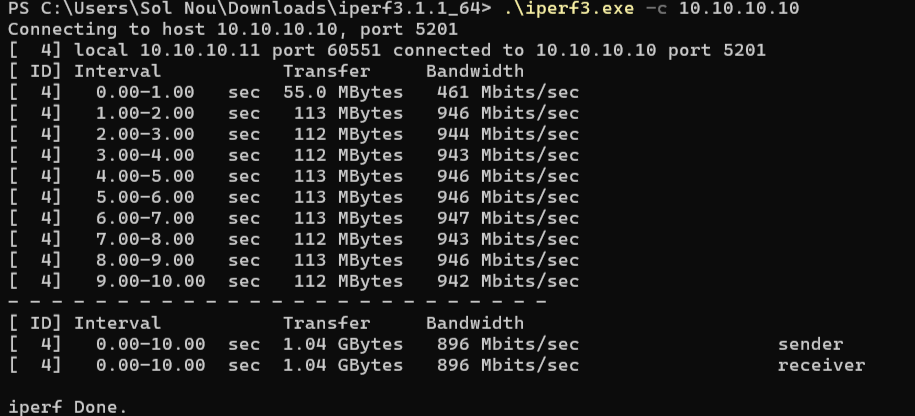


### Protocolo UDP
**Servidor:**

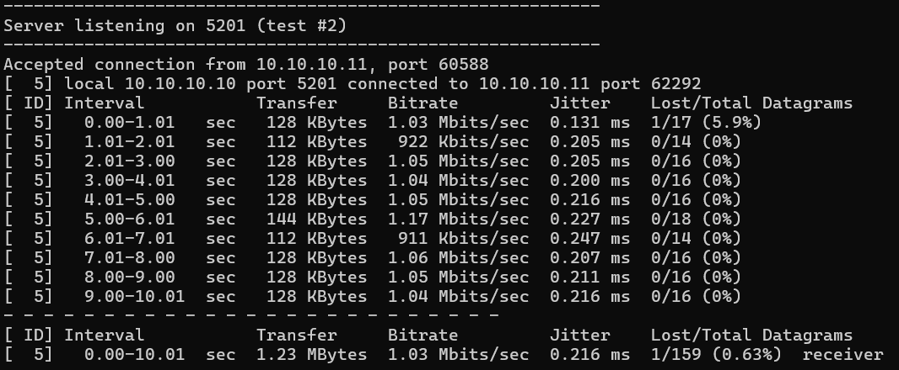

**Cliente:**

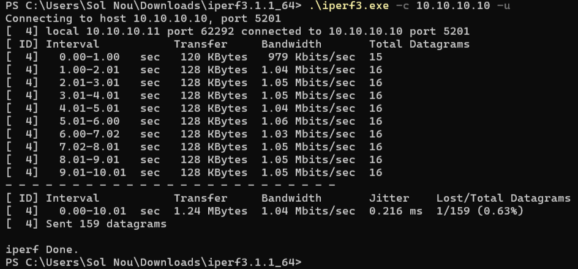

### Captura de Tráfico en Wireshark
Se puede apreciar tanto los paquetes TCP como los paquetes UDP enviados de un host al otro al realizar la prueba de iPerf:

### **Tráfico TCP**

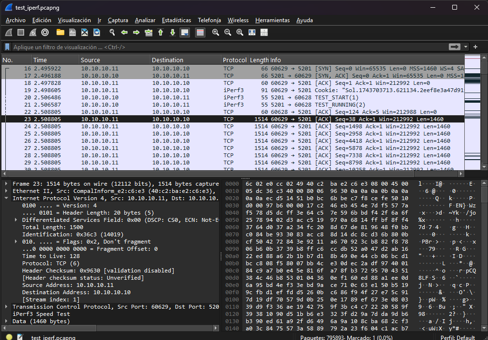

En esta imagen se puede ver:
- Comunicación **TCP** del cliente (`10.10.10.11`) al servidor (`10.10.10.10`), en el puerto `5201`, que es el puerto por defecto de iPerf3.
- Se puede ver el **three-way handshake TCP**:
  - SYN (`Seq=0`) del cliente.
  - SYN-ACK del servidor.
  - ACK final del cliente.

  - Posteriormente, se envían paquetes de datos (tamaño 1460 bytes, típico de TCP con MSS=1460).
  - Numerosos ACKs del servidor para cada segmento recibido.

### **Tráfico UDP**

**Filtro utilizado en UDP:**
```text
ip.src == 10.10.10.11 && ip.dst == 10.10.10.10
```

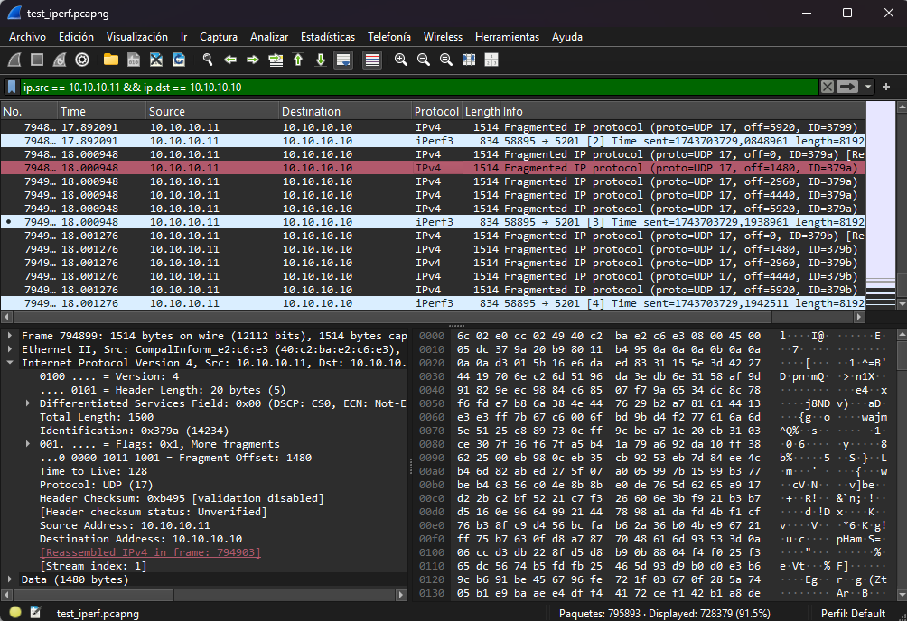

Aquí se puede observar:	
- Se están utilizando datagramas **UDP** desde el puerto `58895` hacia el puerto `5201` también
- Los paquetes están marcados como `Fragmented IP protocol`, lo que indica que los datagramas son demasiado grandes para la MTU (Maximum Transmission Unit) y se están fragmentando a nivel IP.
- Varios fragmentos con el mismo ID (`ID=379a`), enviados secuencialmente (offsets: 0, 1480, 2960...).
- Los paquetes de iPerf3 en modo UDP no requieren ACK (a diferencia del TCP), por eso sólo hay tráfico unidireccional en este protocolo.

Como iPerf3 envía datagramas de 8192 bytes por UDP y excede el máximo que puede transmitirse en una sola trama de red (típico de 1500 bytes), el paquete IP se divide en fragmentos más pequeños:

1. Cada fragmento contiene una parte del mensaje original.
2. Todos los fragmentos comparten el mismo `Identification` (por ejemplo, `0x379a`).
3. Cada fragmento tiene un `Fragment Offset` indicando su posición en el datagrama original.
4. El último fragmento tiene el flag "More fragments" en 0.

Este proceso ocurre en la capa de red (IP) y no en la capa de transporte (como UDP o TCP).

Se analiza el rendimiento **TCP** y **UDP** bajo dos configuraciones: _Cliente_ y _Servidor_.
Las pruebas se llevaron a cabo utilizando la herramienta iPerf3, que permitió establecer conexiones específicas entre las direcciones IP asignadas al cliente y al servidor. En este caso, el **Cliente** (tanto TCP como UDP) inició la comunicación desde la IP `10.10.10.11`, mientras que el **Servidor** (tanto TCP como UDP) respondió desde la IP `10.10.10.10`.

### **Protocolo TCP Cliente y Servidor**

**Resultados comparativos**

A través de las _figuras 11 y 12_, que se mostraron con anterioridad, podemos concluir lo siguiente:

| Parámetro| TCP Cliente| TCP Servidor|
|----------|----------|----------|
| **Ancho de banda promedio**    | 896 Mbits/seg  | 896 Mbits/seg  |
| **Duración de la prueba**    | 10.00 seg | 10.01 seg   |
| **Tamaño promedio de paquetes**    | 106.8 MBytes   | 106.9 MBytes|
| **Pérdida de paquetes**    | No detectada | No detectada   | |

El tamaño promedio de los paquetes se calculó tomando los valores de datos transferidos en cada intervalo (en MBytes) y obteniendo su promedio aritmético. Esto significa que se sumaron todos los tamaños de transferencia para cada intervalo de tiempo (habitualmente de 1 segundo) y luego se dividió entre el número total de intervalos:

$$ \text{Tamaño promedio} = \frac{Suma de los tamaños de paquetes por intervalo}{Número total de intervalos} $$

En ambas pruebas no se detectó pérdida de paquetes. Esto se debe a la estabilidad del protocolo TCP, que maneja de forma eficiente la transmisión de datos mediante retransmisiones en caso de errores. Además, la estabilidad observada en el ancho de banda promedio **(896 Mbits/seg)** en ambos casos indica que no hubo interrupciones significativas en la conexión. Por lo tanto, no se observó una relación directa entre los parámetros evaluados y la pérdida de paquetes en el entorno de prueba controlado. 

### **Protocolo UDP Cliente y Servidor**

**Resultados comparativos**

A través de las _figuras 13 y 14_, podemos observar las siguientes características:

| Parámetro| UDP Cliente| UDP Servidor|
|----------|----------|----------|
| **Ancho de banda promedio**    | 1.04 Mbits/seg  | 1.04 Mbits/seg  |
| **Duración de la prueba**    | 10.01 seg | 10.01 seg   |
| **Tamaño promedio de paquetes**    | 127.2 KBytes   | 126.4 KBytes   |
| **Jitter promedio**    | 0.216 ms | 0.216 ms   |
| **Pérdida de paquetes**    | 1/159 (0.63%) | 1/159 (0.63%)   | |

En ambas pruebas UDP, se observó una pérdida mínima de paquetes *(0.63%)*. Este comportamiento está relacionado con la naturaleza del protocolo UDP, ya que no cuenta con mecanismos para retransmitir paquetes perdidos. A pesar de esto, el jitter promedio fue bajo *(0.216 ms)*, lo que indica que las variaciones en el tiempo de llegada de los paquetes tuvieron un impacto reducido en la calidad de la conexión. El _jitter_ se refiere a las fluctuaciones en el tiempo que tardan los paquetes en llegar al destino, las cuales, cuando son bajas, aseguran estabilidad en la transmisión de datos. 

En las pruebas realizadas con los protocolos UDP y TCP, se observan diferencias notables en su desempeño y características. **TCP** garantiza la entrega de datos mediante retransmisiones y confirmaciones, lo que resultó en la ausencia de pérdida de paquetes en las pruebas. Su desempeño mostró estabilidad en el ancho de banda y tamaño de transferencia, confirmando su fiabilidad en entornos controlados. 

Por otro lado, **UDP** registró una pérdida mínima de paquetes y un promedio bajo de jitter. UDP prioriza la velocidad y la simplicidad sobre la confiabilidad, lo que lo hace más susceptible a la pérdida de datos en redes más dinámicas.

Por último, se realizó esta misma prueba de rendimiento con la herramienta de iPerf3, pero hacia un servidor externo propuesto en clase:

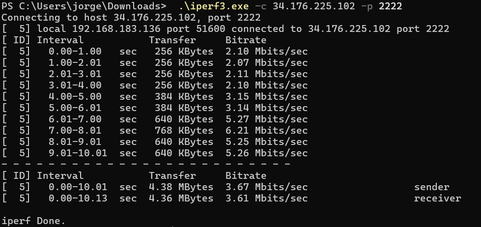

### Parámetros clave
- **Duración de la prueba:** 10.13 segundos
- **Ancho de banda promedio:**
  - **Sender:** 3.67 Mbits/sec
  - **Receiver:** 3.61 Mbits/sec
- **Tamaño total transferido:** aproximadamente 4.36–4.38 MB
- **Tamaño promedio de paquetes:**  entre 256 y 768 KB..


### Comparación con el servidor local

| Parámetro                    | **Servidor local**            | **Servidor externo**             |
|-----------------------------|-------------------------------|----------------------------------|
| **Duración**                | 10 segundos                   | 10.13 segundos                   |
| **Ancho de banda promedio** | 896 Mbits/sec                 | 3.67 Mbits/sec                   |
| **Transferencia total**     | 1.04 GBytes                   | 4.36 MBytes                      |
| **Tamaño de paquetes**      | 113 MBytes/s (muy alto)       | 256–768 KBytes/s (bajo)          |
| **Pérdida de paquetes**     | No visible                    | No visible (pero posible por TCP)|
| **Proximidad**              | Mismo switch (LAN)            | Red externa (WAN, Internet)      |


- El **ancho de banda hacia el servidor externo es drásticamente menor** (3.67 Mbps vs 896 Mbps), lo que evidencia las limitaciones de una red WAN comparada con una red LAN.
- **No se observan pérdidas de paquetes directamente**, pero la diferencia de rendimiento del servidor externo indica a efectos del control de congestión de TCP, como latencia alta y posibles restricciones de red.
- **El tamaño promedio de paquetes es mucho menor** en la prueba externa, lo que también puede influir en el rendimiento.


---

## Discusión y Conclusiones
La práctica permitió adquirir experiencia en el diseño y análisis de redes multi-path en entornos físicos. Se comprobó cómo diferentes configuraciones afectan el rendimiento de la red, y se validaron los conceptos teóricos sobre los protocolos TCP y UDP. El uso de iperf3 y Wireshark fue de suma importancia para la medición de parámetros como el throughput, la latencia y la pérdida de paquetes. En particular, se observó cómo configuraciones agresivas en UDP pueden saturar la red y provocar pérdida de información, mientras que TCP se adapta mejor a las condiciones del canal, aunque con mayor overhead debido a su orientación a la conexión (acuse de recibo).


## Referencias

- [1] Direcciones de red IPv6. Recuperado el 10 de abril de 2025, de https://www.sapalomera.cat/moodlecf/RS/1/course/module8/8.2.5.1/8.2.5.1.html

- [2] Sitio oficial de iperf3. Recuperado el 3 de abril de 2025, de https://iperf.fr

