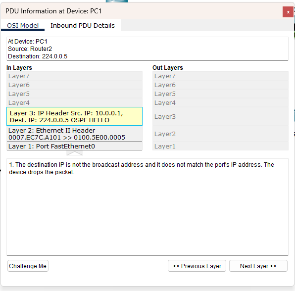

# Trabajo Práctico N°3: 
# Evaluación de performance en redes y ruteo interno dinámico (OSPF)

**Integrantes**  
_Jorge A. Arbach_  
_Bianca A. Fraga_  
_Sol A. Nou_  
_Felipe Pillichody_

**Grupo:** Rackea2  

**Universidad Nacional de Córdoba**  
**Redes de Computadoras**    

**Profesores**: Santiago Henn   
**Fecha**: Jueves 24/04/2025

---

### Información de los autores
 
- **Información de contacto**: _jorge.arbach@mi.unc.edu.ar_, _bianca.fraga@mi.unc.edu.ar_, _felipe.pillichody@mi.unc.edu.ar_, _sol.nou@mi.unc.edu.ar_
---

**OSPF (Open Shortest Path First)** es un protocolo de enrutamiento dinámico basado en el estado de los enlaces. Permite a los routers obtener información sobre el estado de las subredes a las que están conectados y de sus vecinos, con el fin de determinar la mejor ruta para que los paquetes lleguen a su destino. Cuando existen múltiples rutas hacia una misma dirección, OSPF elige la mejor evaluando el costo asociado a cada una. Si la topología de la red cambia, por ejemplo debido a la caída de un enlace, el protocolo detecta el cambio y recalcula automáticamente la mejor ruta disponible.
OSPF utiliza un procedimiento de **inundación** para propagar la información de la topología de la red entre todos los routers de un área. Esta información se encapsula en estructuras llamadas **LSA (Link-State Advertisements)**, que incluyen datos como las interfaces activas, los costos de los enlaces, información sobre los routers vecinos y cualquier cambio detectado en la red. El router que genera un LSA lo envía a todos sus vecinos OSPF, quienes verifican el contenido. Si el LSA contiene información nueva o modificada, se almacena en la **LSDB (Link-State Database)** del router receptor y se reenvía a sus otros vecinos, asegurando que la información se propague de manera completa y consistente a través del área.

La **LSDB** constituye una representación sincronizada de toda la topología de red dentro de un área OSPF. Para garantizar rutas consistentes, todos los routers dentro de un área deben mantener LSDBs idénticas. Basándose en la información almacenada en la LSDB, cada router construye un **grafo** que modela la red, donde los nodos representan routers o redes, y los enlaces representan las conexiones entre ellos.
Para calcular las mejores rutas hacia todos los destinos, OSPF utiliza el **algoritmo Shortest Path First (SPF)**, también conocido como **algoritmo de Dijkstra**. Este algoritmo encuentra los caminos de menor costo desde el router actual hacia todos los demás nodos del grafo, permitiendo así construir una tabla de enrutamiento óptima.

El **costo** de los enlaces es un valor numérico asignado que representa la "distancia" o "esfuerzo" necesario para enviar paquetes a través de ellos. Los costos más bajos indican enlaces preferidos. El algoritmo SPF toma estos costos como métricas para calcular la ruta más corta y eficiente. De esta manera, OSPF optimiza las decisiones de enrutamiento, garantizando una operación de red eficiente, rápida convergencia y alta disponibilidad frente a cambios en la topología.

Para el desarrollo de este trabajo práctico se implementó la siguiente topología:

En primer lugar, diseñamos un esquema de direccionamiento IP para la red, utilizando una red clase A segmentada para los hosts y una red clase C para las conexiones entre routers.

Las direcciones IP de clase A están destinadas a redes muy grandes, abarcando el rango de `0.0.0.0` a `127.255.255.255`. Su máscara de red predeterminada es `255.0.0.0`, lo que permite una enorme cantidad de hosts por red. Si bien en este trabajo solo necesitamos conectar **5 hosts**, esta máscara de subred implica un gran desaprovechamiento del espacio de direcciones, pero se optó por mantenerla para respetar los lineamientos teóricos y porque trabajamos en un entorno de simulación, donde el objetivo es comprender el funcionamiento de las clases de direcciones y no optimizar el espacio. 

Para los hosts, se eligió la red `10.0.0.0/8`. Dividimos la topología en tres subredes: una para H1, H2 y H3; otra para H4; y una última para H5. Para lograr esta segmentación, se utilizaron dos bits adicionales de la porción de host, obteniendo una máscara `/10`.

En cuanto a los routers, se empleó la red `192.168.1.0/24`, correspondiente a una clase C. Se necesitaban subredes para cada enlace entre routers y una adicional para la interfaz Loopback. De esta manera, se definieron 7 subredes, reduciendo la parte de host en 3 bits, lo que nos dio una máscara de `/27`.

Con estos criterios definidos, se planteó el direccionamiento IP de toda la red. 

Los enlaces entre routers utilizan las siguientes subredes:

	Para los hosts, se definieron las siguientes subredes y direcciones IPv4 específicas para cada computadora:

	Finalmente, la asignación de direcciones IP a cada interfaz de los routers quedó organizada de la siguiente manera:

## Habilitar protocolo OSPF

  Una vez configurada toda la parte de direccionamiento IP, se habilita para que los routers utilizan el protocolo OSPF. Para ello, se utiliza el comando `router ospf [ID]` para ingresar al modo de configuración del protocolo OSPF, donde ID es un número de proceso interno del router. Luego, se emplea el comando `network [dirección_ip] [wildcard_mask] area [número_area]` para asociar las interfaces vecinas al router a una área OSPF específica (por momento todos están en la 0), donde la máscara wildcard define qué direcciones se deben incluir en el proceso de enrutamiento, y es el complemento de la máscara de subred. De esta forma notificamos en cada router las redes conectadas directamente a ese dispositivo.

Por ejemplo, desde el router 2, las redes vecinas que tiene son el enlace a R1 (`192.168.1.0`), el enlace con R3 (`192.168.1.64`) y el enlace con S1 (`10.0.0.0`). Configuramos entonces:

Para verificar la conexión punto a punto hacemos ping a una computadora en otra red, de H1 a H4, observando el correcto ruteo:

Para ver tabla de enrutamiento podemos hacer: ´´´show ip route´´´, donde tenemos conexiones _C (red), L (host) y O (conocidas con OSPF)_. También podemos filtrar exclusivamente rutas OSPF con ´´´show ip route OSPF´´´. En el router 1, la tabla de enrutamiento quedó de la siguiente manera:
 

Podemos observar también las redes que el router está notificando con:

Como mencionamos anteriormente, la LSDB es el lugar donde OSPF almacena toda la topología que ha aprendido del área.  Es usada para calcular las rutas más cortas. Mediante el comando ´´´show ip ospf database´´´, se muestra los **LSAs (Link State Advertisements)** que el router conoce, junto con otro tipo de información como el **router ID**, sus enlaces, costos, etc. Esta base debe ser igual para todos los routers de una misma área.
Por ejemplo, al ejecutar el comando en _Router1_ y _Router2_ (tal como se muestran en las imágenes), observamos que la información almacenada es idéntica, asegurando la estabilidad del enrutamiento OSPF en la red.

Se puede observar como el mismo comando en ambos routers nos devuelve la misma información, tal como era esperado.

 
### Análisis de paquetes

En este punto, se busca identificar y analizar los mensajes intercambiados por OSPF. En el tráfico de la simulación vemos mensajes _Hello_. Se utilizan para descubrir y mantener la comunicación con los routers vecinos, estableciendo parámetros como el identificador del router, el área OSPF a la que pertenece, y los parámetros de temporización. Respecto a los temporizadores tenemos dos tipos:

**Hello Interval:** Es el intervalo de tiempo entre el envío de dos mensajes _Hello_ consecutivos desde un router hacia un vecino.

**Dead Interval:** Es el tiempo máximo que un router espera sin recibir un mensaje _Hello_ de un vecino antes de considerarlo inalcanzable. Si un router no recibe respuesta durante este período, se elimina al vecino de su lista.

Estos mensajes son esenciales para asegurar que los routers puedan intercambiar información de manera eficiente y que la topología OSPF se propague de manera adecuada en la red. Visualizamos estos mensajes que se propagan de forma constante periódicamente:

Vemos el paquete que mandó el Router 5 hacia su vecino Router 3:

Al ser un vecino ya conocido anteriormente y no tener modificaciones, lo único que hace es resetear el temporizador. Luego, el Router 3 le envía una respuesta al Router 5 de la forma:

	Otro caso para analizar es cómo esos paquetes _Hello_ también se envían hacia las computadoras. Estos host no ejecutan OSPF ni participan en el proceso de establecimiento de vecindades de OSPF, por lo que el paquete se descarta.

## Segmentación por áreas
En OSPF, **segmentar por áreas** significa dividir una red grande en varias secciones más pequeñas llamadas **áreas** para organizar y optimizar el proceso de enrutamiento.
Cada área agrupa un conjunto de routers y redes que comparten información detallada solo dentro de esa área, en lugar de compartirla con toda la red OSPF. Esto reduce el tamaño de las tablas de enrutamiento, disminuye la cantidad de mensajes de actualización de estado de enlace y mejora el rendimiento general. Para esta instancia vamos a dividir la topología planteada en dos áreas:

Hay que tener en cuenta que OSPF necesita que todas las áreas estén conectadas a _Área 0_ (el Backbone). Para esto debe haber un router que conecta ambas áreas conocido como ABR (Area Border Router), que tiene interfaces en ambas áreas.
Se definió que:
**R1 y R2** pertenecen al **Área 1** (equivalente al Área A).

**R3, R4 y R5** pertenecen al **Área 2** (equivalente al Área B).

Para que ambas áreas puedan comunicarse correctamente, se configuró el **enlace entre R2 y R3** dentro del **Área 0**, actuando como **enlace backbone**.
Esto permite que:

**R2** funcione como ABR entre **Área 1** y **Área 0**.

**R3** funcione como ABR entre **Área 2** y **Área 0**.
Además, el enlace físico entre **R1 y R3**, correspondiente a la red `192.168.1.32/27`, fue configurado en **Área 1**, ya que **ambos routers deben tener la misma área en interfaces conectadas directamente**. Este enlace podría haberse configurado en Área 2 también, siempre que ambos lados coincidieran.

Se concluye que:
**R1** comparte LSDB con **R2** y **R3** dentro del **Área 1**, pero las rutas hacia **Área 2** le llegan como **rutas inter-área (O IA)** gracias a los ABRs.

**R2** tiene visibilidad de las LSDB de **Área 1** y **Área 0**, cumpliendo el rol de ABR.

**R3** tiene LSDB de **Área 0**, **Área 1**, y **Área 2**, siendo un punto clave de interconexión.

**R4 y R5** comparten únicamente la LSDB de **Área 2**, y aprenden las rutas externas a su área como **O IA** a través de **R3**.
Si leemos las entradas LSDB en un router de cada una de las áreas podemos ver:
**Área 1**

**Área 2**

El análisis de la LSDB en **Área 1** y **Área 2** muestra diferencias clave en la propagación de información dentro del protocolo OSPF. Ambas áreas contienen _Router Link States_ y _Network Link States_, pero también incluyen _Summary LSAs_, lo que confirma el intercambio de rutas entre áreas.

Si bien **Área 2** gestiona un mayor flujo de información debido a la cantidad de routers que la conforman y su conexión con **Área 0**, **Área 1** también participa en la redistribución de rutas inter-área, recibiendo información a través de los ABRs (R2 y R3). Esta interacción entre áreas permite una administración eficiente del enrutamiento y optimiza el tráfico de la red.

**Área 0**

	Una forma de verificar la funcionalidad OSPF es ver desde el router _R2_ y consultar la información acerca de los vecinos _R1_ y _R3_. Por lo tanto, obtenemos:

En la imagen, se pueden identificar los dos vecinos, donde:

`192.168.1.130`, con estado **FULL/DR**, lo que indica que es el _Designated Router (DR)_ en la red.
`192.168.1.194`, con estado **FULL/BDR**, que corresponde al _Backup Designated Router (BDR)_

Estos roles aseguran la estabilidad del enrutamiento OSPF, facilitando la sincronización de la topología de la red. Además, los tiempos de expiración muestran que la comunicación entre los routers es activa. Este tipo de información que se provee es útil para supervisar el estado de la red y detectar posibles inconvenientes en la conectividad.

	Por último, en el router _R2_ consultamos la información sobre las operaciones del protocolo de enrutamiento:

Esta imagen revela que el router _R2_ opera como un **Area Border Router (ABR)**, participando en la comunicación entre múltiples áreas OSPF, tal como lo diseñamos. Se destacan parámetros esenciales **Shortest Path First (SPF)**, como los tiempos de ejecución y actualización de LSAs, lo que garantiza una eficiente propagación de información y estabilidad en la red.

Además, se confirma que el router _R2_ mantiene una operatividad óptima dentro del protocolo OSPF, con vecinos correctamente sincronizados y un procesamiento eficiente de rutas.

## Costos de rutas

	Hemos mencionado que OSPF funciona con un algoritmo shortest path, que calcula la mejor ruta teniendo en cuenta el costo de cada enlace. Si no se configura el costo manualmente, OSPF lo calcula así:

- Costo = Reference Bandwidth / Interface Bandwidth

Donde **Reference Bandwidth** es por defecto es 100 Mbps (es decir, 100,000,000 bits/segundo)

En el ambiente de simulación que se utilizó, de momento todos los valores de ancho de banda de las interfaces (y por ende sus costes) son los mismos. El costo lo podemos encontrar en la salida de ´´´show ip ospf interface ´´´. 

En este punto haremos, desde el Router 2, un traceroute a la dirección de H5. 

La **salida del traceroute** confirma que los paquetes atraviesan **tres hops** antes de alcanzar H5, validando la propagación de rutas en la LSDB. La baja latencia observada en cada salto sugiere que la red opera de manera estable, sin retrasos significativos en la transmisión de datos.

	Por esta salida, podemos interpretar que la ruta fue:

Esta imagen muestra la topología de la red, destacando la interconexión entre **Área 1, Área 0 y Área 2**, con **R2** como punto de inicio y **H5** como destino final. La segmentación de la red y la existencia de ABRs como R2 y R3 permiten la redistribución de rutas entre áreas a través de **Área 0 (Backbone)**. 

Luego, configuraremos el enlace entre R3 y R5 con un costo de 20, para ver cómo afecta al hacer un traceroute desde el mismo router. El costo de 20 fue elegido de manera arbitraria, y de esta forma se anula el cálculo en base al ancho de banda.  La modificación se realiza con:

	Como vemos en la tercer línea de la siguiente captura, el costo fue cambiado a 20 :

	Ahora la salida de ´´´traceroute 10.128.0.2´´ desde el mismo origen, dado que el costo del enlace R3-R4 ha aumentado, se puede observar que se evita ese camino, obteniendo:

Estas dos últimas imágenes reflejan el impacto de la configuración del **costo en OSPF** sobre la selección de rutas y cómo el protocolo ajusta dinámicamente el tráfico en función de los enlaces disponibles. 

### Redistribución de una ruta OSPF predeterminada en R1

Con el objetivo de simular la conectividad de una red interna hacia un proveedor de servicios de Internet (ISP), se llevaron a cabo las siguientes configuraciones en el router R1:

***Configuración de una dirección de loopback para simular un enlace al ISP:***

Se creó una interfaz de loopback en el router R1 con la dirección IP 192.168.1.194/27, la cual representa el punto de enlace hacia un ISP simulado. Se realizó con las siguientes líneas:

**Configuración de una ruta estática predeterminada:**

Se añadió en R1 una ruta estática por defecto utilizando el siguiente comando:

´´´ip route 0.0.0.0 0.0.0.0 loopback 0´´´

En redes, la ruta estática predeterminada es 0.0.0.0 0.0.0.0. Esta ruta le indica al dispositivo que, para todo tráfico destinado a redes no conocidas (sin coincidencias más específicas en la tabla de enrutamiento), utilice como siguiente salto la dirección IP configurada en la loopback (simulando el acceso a Internet).

Redistribución de la ruta estática predeterminada en OSPF: 

Finalmente, para permitir que los demás routers en el área OSPF conozcan esta ruta por defecto y puedan enrutar el tráfico hacia el ISP a través de R1, se utilizó el siguiente comando en el proceso OSPF del router:

default-information originate

Este comando dentro del proceso OSPF en R1 indica al router que debe anunciar su ruta estática por defecto al resto de los vecinos OSPF. De este modo, todos los routers que reciben esta actualización OSPF la incorporan a su tabla de enrutamiento como una ruta externa tipo 2 (O*E2), lo que les permite reenviar tráfico desconocido hacia R1, actuando así como puerta de enlace hacia el ISP simulado. Vemos por ejemplo en Router 2:

---
## Shutdown de interfaces

Si se cae la interfaz R2 ↔ R1 (Área 1):
- R2 ya no ve a R1 como vecino OSPF
- Se elimina el LSA tipo 1 de R1 de la LSDB de Área 1.
- R2 deja de anunciar rutas que existían sólo a través de R1.

Si se cae la interfaz R2 ↔ R3 (Área 0):
- Grave impacto, porque R2 y R3 son los ABRs que conectan Área 1 y Área 2 al Backbone (Área 0).
- Sin conexión a Área 0, OSPF ya no puede enrutar entre áreas. Área 1 y Área 2 quedan aisladas entre sí (no se pueden intercambiar rutas).
- R2 y R3 pueden seguir enrutando dentro de sus áreas locales, pero no hacia otras áreas.

En routers inter-área (como R1), desaparecen rutas O IA.
- Si se cae la interfaz interna de R2 a SW1 (10.0.0.0/8):
- R2 ya no puede alcanzar esa subred.
- OSPF elimina la LSA tipo 1 que anunciaba esa subred.
- Otros routers (como R1 o R5) ya no tienen esa red en sus tablas de ruta.

R2 podría seguir funcionando como ABR si las demás interfaces siguen up.

En general, cuando una interfaz cae OSPF responde de la siguiente manera:
Primero, detecta el estado down en la interfaz. Inmediatamente despues manda un LSA tipo 1 indicando que ese enlace ya no está disponible. De esta forma, los vecinos actualizan su LSDB y el algoritmo SPF (Dijkstra) se vuelve a ejecutar para recalcular rutas.

---

## RIB y FIB
La RIB incluye todas las rutas aprendidas desde diferentes protocolos (OSPF, BGP, RIP). Cuando se ejecuta el comando show ip route, lo que se obtiene es la RIB.

La FIB (Forwarding Information Base) es una tabla utilizada por los routers para tomar decisiones de reenvío de paquetes IP. A diferencia de la RIB (Routing Information Base), que contiene todas las rutas aprendidas por los protocolos de enrutamiento y configuraciones estáticas, la FIB almacena únicamente las rutas óptimas ya procesadas y listas para ser utilizadas por el plano de reenvío. Esta tabla se genera a partir de la RIB y contiene información específica como el prefijo de destino, la dirección del siguiente salto y la interfaz de salida. En equipos Cisco, la FIB es mantenida por CEF (Cisco Express Forwarding), lo que permite un reenvío de paquetes basado en hardware altamente escalable y con menor carga para el CPU del router.

---

## Referencias
Cisco Systems. (s.f.). Configurar OSPF. Cisco. https://www.cisco.com/c/es_mx/support/docs/ip/open-shortest-path-first-ospf/118879-configure-ospf-00.html	

FRRouting Project. (s.f.). FRRouting documentation. https://docs.frrouting.org/en/latest/	

Network Academy. (s.f.). OSPF - CCNA. https://www.networkacademy.io/ccna/ospf		

Stallings, W. (2006). Organización y arquitectura de computadores: Diseño para el rendimiento (7.ª ed.). Pearson Educación.	
