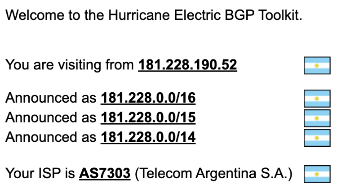
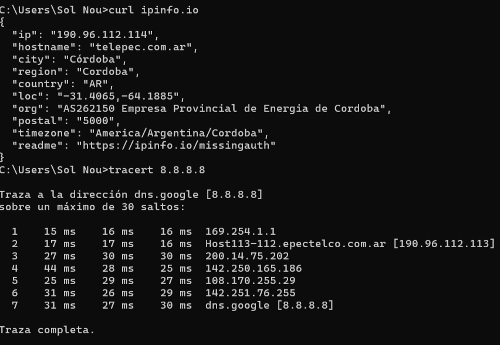

**Tipos de mensajes BGP**

Todos los mensajes BGP están encapsulados en TCP, lo que garantiza la confiabilidad del transporte. Existen cuatro tipos principales de mensajes:
- *OPEN*: Inicia la sesión entre vecinos, se negocia versión, ASN, etc. Similar a un 	HELLO packet en OSPF.
- *KEEPALIVE*: Confirma que la conexión sigue viva (heartbeat)
- *UPDATE*: Anuncia nuevas rutas o retira rutas inválidas
- *NOTIFICATION*: Indica errores y finaliza la conexión

**Formato general de un paquete BGP (simplificado):**
| Campo   | Tamaño     | Descripción                                              |
|---------|------------|----------------------------------------------------------|
| Marker  | 16 bytes   | Para autenticación o detección de errores               |
| Length  | 2 bytes    | Longitud total del mensaje                               |
| Type    | 1 byte     | OPEN (1), UPDATE (2), NOTIFICATION (3), KEEPALIVE (4)    |
| Datos   | variable   | Depende del tipo de mensaje                              |

BGP puede funcionar en dos contextos distintos: 

- *eBGP*: conecta distintos AS y permite salir a Internet.

- *iBGP*: distribuye esa información dentro del mismo AS, para que todos los routers sepan cómo enrutar el tráfico.
 
Si bien iBGP opera dentro de un AS, no se considera un protocolo de enrutamiento intradominio como OSPF o RIP, ya que estos están diseñados para calcular rutas internas automáticamente usando métricas como el costo, mientras que iBGP simplemente distribuye rutas externas aprendidas por eBGP, sin hacer descubrimiento de rutas ni cálculos internos complejos. Por lo que eBGP e iBGP usen el mismo protocolo, su comportamiento cambia bastante según el caso.

Supongamos que Telecom (AS7303) quiere intercambiar rutas con Google (AS15169). Para eso usan eBGP (External BGP). Se usa cuando los routers están en redes administradas por distintas organizaciones. Cada router anuncia sus rutas públicas al otro, permitiendo que el tráfico fluya entre Internet y las redes internas.

Cuando Router A (Telecom) recibe una ruta de Router B (Google), modifica el atributo NEXT_HOP, indicando su propia IP como el nuevo punto de entrada.

Ahora supongamos que dentro de Telecom, varios routers distribuyen internamente las rutas aprendidas por eBGP. Ese intercambio se hace usando iBGP (Internal BGP). Es decir, no se anuncian nuevas rutas, sino que se propagan internamente las rutas aprendidas desde eBGP.

El NEXT_HOP no se modifica, lo que significa que los routers deben tener rutas internas para alcanzar el próximo salto.

El iBGP es clave para los AS de tránsito. Un AS de tránsito es aquel que permite que el tráfico pase a través de él entre dos AS diferentes, sin ser ni el origen ni el destino final del tráfico. 

Veamos el caso de la topología de la consigna:

El tráfico puede ir desde AS1 (R1) hacia AS3 (R4) pasando por AS2. AS2 no origina ni termina ese tráfico, solo lo transporta de un AS a otro. Por lo tanto, AS2 es de tránsito, mientras que AS1 y AS3 son redes de borde: solo intercambian tráfico con sus vecinos, pero no transportan tráfico de terceros.

---

Volvamos a nuestra conexión actual, recordemos que estamos usando el AS7303. Sabemos que tiene conexiones BGP con 244 Sistemas Autónomos distintos (244 peers), es decir, 244 relaciones eBGP activas

Si buscamos esta ASN en [BGPView](https://bgpview.io/) podemos ver, entre otros datos,  el siguiente gráfico:

En este grafo vemos representadas algunas de las relaciones que AS7303 mantiene con otros AS. En particular, se muestran 4 conexiones eBGP visibles (con AS3257, AS3356, AS6762 y AS6453).
Esto no significa que tenga solo 4 vecinos eBGP, sino que el gráfico está simplificado y muestra las relaciones principales observadas en el enrutamiento global, como algunos de sus proveedores de tránsito (upstreams) y peers más significativos.

**Aclaración** : Las relaciones iBGP no aparecen en sitios públicos porque son internas y no se observan desde el exterior.

Cuando dos Sistemas Autónomos establecen relaciones BGP, no todas las conexiones son iguales. Se pueden clasificar según el tipo de servicio que se prestan entre sí:
- *Upstream*: Es un proveedor de tránsito. Permite al AS que lo contrata alcanzar el resto de Internet. Por ejemplo, si AS7303 se conecta con AS3356 (Lumen) para tener salida global, entonces AS3356 es un upstream de AS7303.

- *Downstream*: Es el cliente del AS. Si una empresa o red más pequeña contrata a AS7303 para conectarse a Internet, entonces esa red es un downstream de AS7303.

- *Peer*: Es una relación entre pares (generalmente gratuita) que permite intercambiar rutas de clientes, pero no brinda tránsito completo. Este tipo de acuerdo es común entre ISPs de tamaño similar o dentro de puntos de intercambio como CABASE.

Estas relaciones influyen en qué rutas se aceptan, prefieren o filtran. Además, ayudan a determinar si un AS es de borde (solo intercambia tráfico propio y de clientes) o de tránsito (permite que el tráfico pase entre terceros).

Ahora veamos qué sucede si cambiamos de red. Recordemos que descubrimos originalmente la AS que estamos utilizando para acceder a Internet con https://bgp.he.net/ . Desde la red del hogar de uno de los integrantes obtenemos:

Si probamos conectados a la red de la facultad obtenemos:

También probando, por ejemplo, desde la red del lugar de trabajo de uno de los integrantes del grupo obtenemos:

Si queremos comparar esta ultima con la AS7303 de Telecom, podemos ver una gran diferencia en la cantidad de peers, teniendo AS262150  conexiones BGP con únicamente 13 Sistemas Autónomos, frente a los 244 de Telecom, demostrando la diferencia en el tamaño de la red. 

Además, la pagina https://bgpview.io/ nos da otro parametro para comparar, _Traffic Estimation_, diferenciado entre 10-20Tbps que tiene AS7303 y 50-100Gbps de AS262150,  lo que nos da una idea del tamaño de tráfico manejado por cada AS, evidenciando la diferencia de escala de ambos proveedores.

Como última prueba para comparar ambos ASN, vamos a observar el recorrido de los paquetes hacia un destino común, como el DNS de Google 8.8.8.8. De esta forma vemos el camino de red que usa cada ASN para llegar a Internet, permitiendo ver los proveedores de tránsitos, los saltos y la eficiencia de cada enrutamiento. 
Desde la conexión a la red AS7303 de Telecom Argentina, observamos esta salida:

Por el otro lado, desde la red AS262150 de Empresa Provincial de Energia de Cordoba, obtenemos:

Los tracert realizados al servidor público 8.8.8.8 desde dos sistemas autónomos distintos permiten observar diferencias en el enrutamiento y la conectividad de cada red. En el caso de AS7303 (Telecom Argentina), la traza presenta múltiples saltos intermedios que no responden, posiblemente por filtros ICMP, antes de llegar a direcciones IP asociadas a Google (por ejemplo, 72.14.194.198), siendo una ruta más compleja y requiriendo 10 saltos. 

Por el otro lado, la traza desde AS262150 (EPEC) muestra un camino más directo y completamente visible, con solo siete saltos hasta el destino, pasando por direcciones IP internas, luego por la IP 200.14.75.202 perteneciente a (CABASE Camara Arg de Base de Datos y Serv en Linea) y rápidamente llegando a la red de Google. Este segundo trace cuenta con un camino más limpio y controlado hacia Internet.

---

Por último, vamos con un caso práctico que permite ver la importancia del protocolo BGP:

El 4 de octubre de 2021, Facebook, junto con sus servicios asociados como WhatsApp, Instagram, Messenger y Oculus, experimentó una interrupción global que duró más de seis horas. Este incidente afectó a aproximadamente tres mil millones de usuarios en todo el mundo y fue causado por una serie de errores en la configuración del protocolo de enrutamiento BGP (Border Gateway Protocol) en la red troncal de la empresa.

Durante una operación de mantenimiento rutinaria, se ejecutó un comando que desconectó accidentalmente los centros de datos de Facebook de su red troncal. Como resultado, los routers de la empresa dejaron de anunciar sus rutas BGP, lo que hizo que los servidores de nombres de dominio (DNS) de Facebook fueran inaccesibles desde Internet. 

Esto provocó que los navegadores y aplicaciones no pudieran resolver los nombres de dominio de Facebook, haciendo que sus servicios parecieran haber desaparecido del mapa de Internet .
Consecuencias del apagón:

- Interrupción global de servicios: Facebook, Instagram, WhatsApp y otros servicios asociados estuvieron inaccesibles para usuarios de todo el mundo durante más de seis horas .
- Impacto en la comunicación interna: Los empleados de Facebook no pudieron utilizar herramientas internas, acceder a correos electrónicos ni ingresar a las oficinas, ya que los sistemas de autenticación también dependían de la red afectada
- Pérdidas económicas: Se estima que la interrupción causó pérdidas de al menos 60 millones de dólares en ingresos publicitarios y una caída del 5% en el valor de las acciones de la empresa. 
- Afectación a terceros: Servicios que dependen de la autenticación a través de Facebook también se vieron afectados, impidiendo que los usuarios accedieran a diversas plataformas y aplicaciones.

Este incidente destacó la fragilidad de la infraestructura de Internet y la importancia de una configuración adecuada de los protocolos de enrutamiento. También subrayó la necesidad de contar con mecanismos de recuperación efectivos y redundancias que permitan mitigar el impacto de errores humanos en sistemas críticos.

