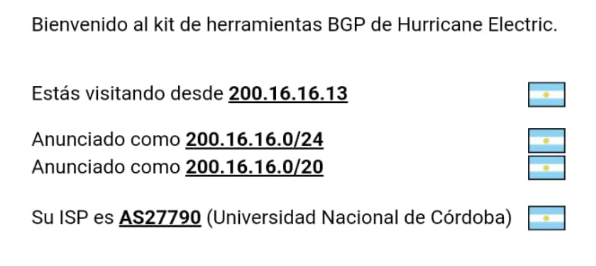
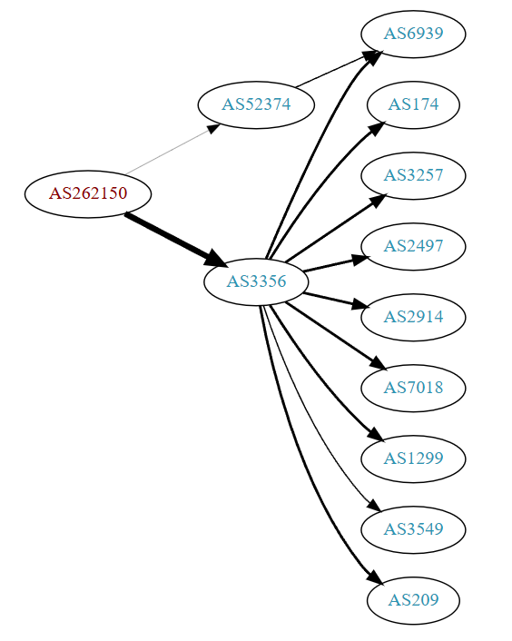
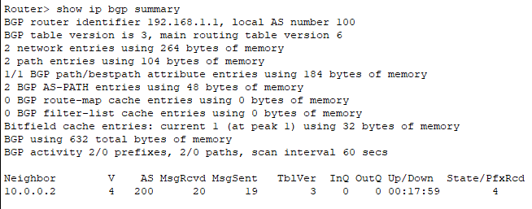
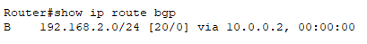
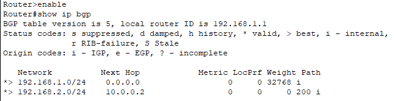
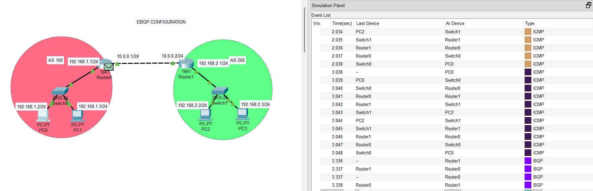
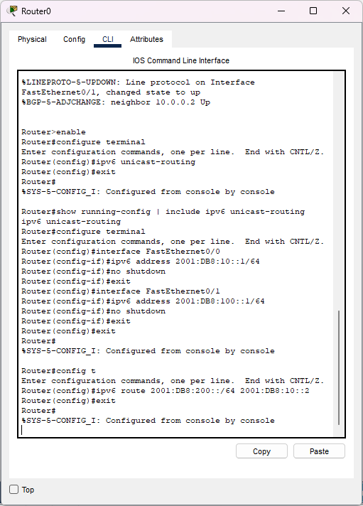
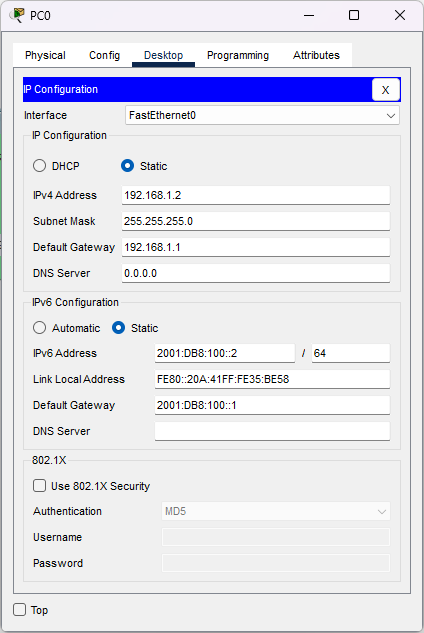
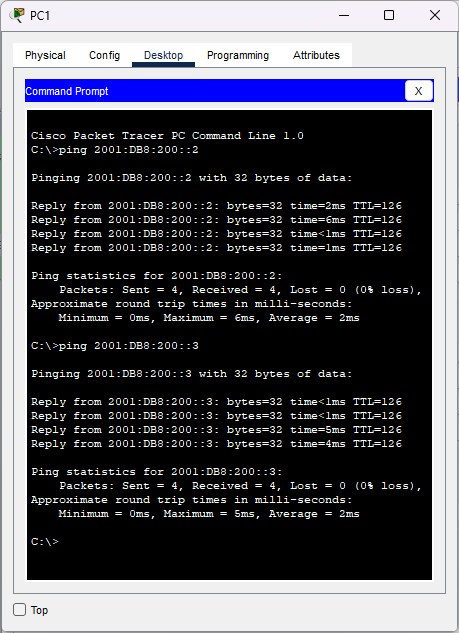

**Tipos de mensajes BGP**

Todos los mensajes BGP están encapsulados en TCP, lo que garantiza la confiabilidad del transporte. Existen cuatro tipos principales de mensajes:
- *OPEN*: Inicia la sesión entre vecinos, se negocia versión, ASN, etc. Similar a un 	HELLO packet en OSPF.
- *KEEPALIVE*: Confirma que la conexión sigue viva (heartbeat)
- *UPDATE*: Anuncia nuevas rutas o retira rutas inválidas
- *NOTIFICATION*: Indica errores y finaliza la conexión

**Formato general de un paquete BGP (simplificado):**
| Campo   | Tamaño     | Descripción                                              |
|---------|------------|----------------------------------------------------------|
| Marker  | 16 bytes   | Para autenticación o detección de errores               |
| Length  | 2 bytes    | Longitud total del mensaje                               |
| Type    | 1 byte     | OPEN (1), UPDATE (2), NOTIFICATION (3), KEEPALIVE (4)    |
| Datos   | variable   | Depende del tipo de mensaje                              |

BGP puede funcionar en dos contextos distintos: 

- *eBGP*: conecta distintos AS y permite salir a Internet.

- *iBGP*: distribuye esa información dentro del mismo AS, para que todos los routers sepan cómo enrutar el tráfico.
 
Si bien iBGP opera dentro de un AS, no se considera un protocolo de enrutamiento intradominio como OSPF o RIP, ya que estos están diseñados para calcular rutas internas automáticamente usando métricas como el costo, mientras que iBGP simplemente distribuye rutas externas aprendidas por eBGP, sin hacer descubrimiento de rutas ni cálculos internos complejos. Por lo que eBGP e iBGP usen el mismo protocolo, su comportamiento cambia bastante según el caso.

Supongamos que Telecom (AS7303) quiere intercambiar rutas con Google (AS15169). Para eso usan eBGP (External BGP). Se usa cuando los routers están en redes administradas por distintas organizaciones. Cada router anuncia sus rutas públicas al otro, permitiendo que el tráfico fluya entre Internet y las redes internas.

Cuando Router A (Telecom) recibe una ruta de Router B (Google), modifica el atributo NEXT_HOP, indicando su propia IP como el nuevo punto de entrada.

Ahora supongamos que dentro de Telecom, varios routers distribuyen internamente las rutas aprendidas por eBGP. Ese intercambio se hace usando iBGP (Internal BGP). Es decir, no se anuncian nuevas rutas, sino que se propagan internamente las rutas aprendidas desde eBGP.

El NEXT_HOP no se modifica, lo que significa que los routers deben tener rutas internas para alcanzar el próximo salto.

El iBGP es clave para los AS de tránsito. Un AS de tránsito es aquel que permite que el tráfico pase a través de él entre dos AS diferentes, sin ser ni el origen ni el destino final del tráfico. 

Veamos el caso de la topología de la consigna:

El tráfico puede ir desde AS1 (R1) hacia AS3 (R4) pasando por AS2. AS2 no origina ni termina ese tráfico, solo lo transporta de un AS a otro. Por lo tanto, AS2 es de tránsito, mientras que AS1 y AS3 son redes de borde: solo intercambian tráfico con sus vecinos, pero no transportan tráfico de terceros.

---

Volvamos a nuestra conexión actual, recordemos que estamos usando el AS7303. Sabemos que tiene conexiones BGP con 244 Sistemas Autónomos distintos (244 peers), es decir, 244 relaciones eBGP activas

Si buscamos esta ASN en [BGPView](https://bgpview.io/) podemos ver, entre otros datos,  el siguiente gráfico:

En este grafo vemos representadas algunas de las relaciones que AS7303 mantiene con otros AS. En particular, se muestran 4 conexiones eBGP visibles (con AS3257, AS3356, AS6762 y AS6453).
Esto no significa que tenga solo 4 vecinos eBGP, sino que el gráfico está simplificado y muestra las relaciones principales observadas en el enrutamiento global, como algunos de sus proveedores de tránsito (upstreams) y peers más significativos.

**Aclaración** : Las relaciones iBGP no aparecen en sitios públicos porque son internas y no se observan desde el exterior.

Cuando dos Sistemas Autónomos establecen relaciones BGP, no todas las conexiones son iguales. Se pueden clasificar según el tipo de servicio que se prestan entre sí:
- *Upstream*: Es un proveedor de tránsito. Permite al AS que lo contrata alcanzar el resto de Internet. Por ejemplo, si AS7303 se conecta con AS3356 (Lumen) para tener salida global, entonces AS3356 es un upstream de AS7303.

- *Downstream*: Es el cliente del AS. Si una empresa o red más pequeña contrata a AS7303 para conectarse a Internet, entonces esa red es un downstream de AS7303.

- *Peer*: Es una relación entre pares (generalmente gratuita) que permite intercambiar rutas de clientes, pero no brinda tránsito completo. Este tipo de acuerdo es común entre ISPs de tamaño similar o dentro de puntos de intercambio como CABASE.

Estas relaciones influyen en qué rutas se aceptan, prefieren o filtran. Además, ayudan a determinar si un AS es de borde (solo intercambia tráfico propio y de clientes) o de tránsito (permite que el tráfico pase entre terceros).

Ahora veamos qué sucede si cambiamos de red. Recordemos que descubrimos originalmente la AS que estamos utilizando para acceder a Internet con https://bgp.he.net/ . Desde la red del hogar de uno de los integrantes obtenemos:

Si probamos conectados a la red de la facultad obtenemos:

También probando, por ejemplo, desde la red del lugar de trabajo de uno de los integrantes del grupo obtenemos:

Si queremos comparar esta ultima con la AS7303 de Telecom, podemos ver una gran diferencia en la cantidad de peers, teniendo AS262150  conexiones BGP con únicamente 13 Sistemas Autónomos, frente a los 244 de Telecom, demostrando la diferencia en el tamaño de la red. 

Además, la pagina https://bgpview.io/ nos da otro parametro para comparar, _Traffic Estimation_, diferenciado entre 10-20Tbps que tiene AS7303 y 50-100Gbps de AS262150,  lo que nos da una idea del tamaño de tráfico manejado por cada AS, evidenciando la diferencia de escala de ambos proveedores.

Como última prueba para comparar ambos ASN, vamos a observar el recorrido de los paquetes hacia un destino común, como el DNS de Google 8.8.8.8. De esta forma vemos el camino de red que usa cada ASN para llegar a Internet, permitiendo ver los proveedores de tránsitos, los saltos y la eficiencia de cada enrutamiento. 
Desde la conexión a la red AS7303 de Telecom Argentina, observamos esta salida:

Por el otro lado, desde la red AS262150 de Empresa Provincial de Energia de Cordoba, obtenemos:

Los tracert realizados al servidor público 8.8.8.8 desde dos sistemas autónomos distintos permiten observar diferencias en el enrutamiento y la conectividad de cada red. En el caso de AS7303 (Telecom Argentina), la traza presenta múltiples saltos intermedios que no responden, posiblemente por filtros ICMP, antes de llegar a direcciones IP asociadas a Google (por ejemplo, 72.14.194.198), siendo una ruta más compleja y requiriendo 10 saltos. 

Por el otro lado, la traza desde AS262150 (EPEC) muestra un camino más directo y completamente visible, con solo siete saltos hasta el destino, pasando por direcciones IP internas, luego por la IP 200.14.75.202 perteneciente a (CABASE Camara Arg de Base de Datos y Serv en Linea) y rápidamente llegando a la red de Google. Este segundo trace cuenta con un camino más limpio y controlado hacia Internet.

---

Por último, vamos con un caso práctico que permite ver la importancia del protocolo BGP:

El 4 de octubre de 2021, Facebook, junto con sus servicios asociados como WhatsApp, Instagram, Messenger y Oculus, experimentó una interrupción global que duró más de seis horas. Este incidente afectó a aproximadamente tres mil millones de usuarios en todo el mundo y fue causado por una serie de errores en la configuración del protocolo de enrutamiento BGP (Border Gateway Protocol) en la red troncal de la empresa.

Durante una operación de mantenimiento rutinaria, se ejecutó un comando que desconectó accidentalmente los centros de datos de Facebook de su red troncal. Como resultado, los routers de la empresa dejaron de anunciar sus rutas BGP, lo que hizo que los servidores de nombres de dominio (DNS) de Facebook fueran inaccesibles desde Internet. 

Esto provocó que los navegadores y aplicaciones no pudieran resolver los nombres de dominio de Facebook, haciendo que sus servicios parecieran haber desaparecido del mapa de Internet .
Consecuencias del apagón:

- Interrupción global de servicios: Facebook, Instagram, WhatsApp y otros servicios asociados estuvieron inaccesibles para usuarios de todo el mundo durante más de seis horas .
- Impacto en la comunicación interna: Los empleados de Facebook no pudieron utilizar herramientas internas, acceder a correos electrónicos ni ingresar a las oficinas, ya que los sistemas de autenticación también dependían de la red afectada
- Pérdidas económicas: Se estima que la interrupción causó pérdidas de al menos 60 millones de dólares en ingresos publicitarios y una caída del 5% en el valor de las acciones de la empresa. 
- Afectación a terceros: Servicios que dependen de la autenticación a través de Facebook también se vieron afectados, impidiendo que los usuarios accedieran a diversas plataformas y aplicaciones.

Este incidente destacó la fragilidad de la infraestructura de Internet y la importancia de una configuración adecuada de los protocolos de enrutamiento. También subrayó la necesidad de contar con mecanismos de recuperación efectivos y redundancias que permitan mitigar el impacto de errores humanos en sistemas críticos.

# Parte II - Simulaciones y análisis

Para iniciar el desarrollo de esta segunda parte del proyecto, utilizó una implementación otorgada por el profesor, de una topología de red para dos **Sistemas Autónomos (AS100 - AS200)** en un entorno virtual, utilizando el software _Packet Tracer_ como herramienta principal:

Para evaluar el estado de **BGP** en la red, es necesario ejecutar una serie de comandos que nos permitirán analizar su configuración y funcionamiento, tal como se muestra a continuación:

* `show ip bgp summary`: este comando muestra el estado de las sesiones BGP con los vecinos, permitiendo verificar si la comunicación está establecida correctamente. 
* `show running-config | section router bgp`: extrae de toda la configuración del router, la referida a BGP del router, indicando los vecinos definidos, el número de AS y otros parámetros clave.
* `show ip protocols`: revela los protocolos de enrutamiento activos en el dispositivo, incluyendo información sobre el funcionamiento de BGP.
* `show ip bgp`: presenta la tabla de enrutamiento BGP, con detalles sobre las rutas anunciadas y aprendidas, su AS_PATH y otros tipos de atributos. 
* `show ip route bgp`: muestra la tabla de enrutamiento, permitiendo ver cómo BGP se integra con el resto de los protocolos de enrutamiento.

La **evidencia de que BGP** está funcionando correctamente suele encontrarse cuando ejecutamos el comando `show ip bgp summary` en la terminal del CLI de cada router, verificando el estado de las sesiones BGP y el intercambio de rutas con los vecinos.

La imagen confirma que BGP está funcionando correctamente, ya que la sesión con el vecino pudo ser establecida y está intercambiando rutas activamente. Además, el protocolo operó de manera continua sin interrupciones.

En Packet Tracer, los estados de BGP se representan mediante números en lugar de nombres convencionales. Se observa que el `Router0` mantiene una sesión BGP con el vecino `10.0.0.2`, cuyo estado en la columna State es **4**. Esto significa que el router ha enviado un mensaje de apertura (`OpenSent`), indicando que el proceso de negociación BGP está avanzando, aunque aún no se ha alcanzado el estado **Established (6)**.

Con respecto a las **tablas de ruteo**, vamos a tener dos tipos de tablas:

* **Tabla de enrutamiento**: se obtiene ejecutando el comando `show ip route bgp`. Esta tabla muestra todas las rutas que el router conoce y cómo debe enviar los paquetes hacia sus destinos. Indica qué redes son alcanzables, y específicamente con este comando filtra las que fueron aprendidas del protocolo **BGP**. A diferencia de la _tabla de enrutamiento general_ (obtenida con `show ip route`), que incluye rutas de diferentes protocolos, mostrando cómo fueron aprendidas (si directamente conectadas, por protocolos dinámicos como BGP, OSPF,etc. o configuradas manualmente) y a través de qué interfaz deben ser enviadas.

Decidimos ejecutar `show ip route bgp` porque nos interesa evaluar únicamente las rutas propagadas por BGP, sin interferencias de otros protocolos. 

A través de la imagen, se observa que la ruta fue aprendida mediante BGP (se encuentra marcado con la letra **“B”**). Esta se alcanza a través del **Next-Hop 10.0.0.2**, lo que significa que el router enviará los paquetes a esa dirección para alcanzar la red de destino `192.168.2.0/24`. La métrica **[20/0]** indica la distancia administrativa y otros parámetros internos utilizados por el protocolo. Por último, el tiempo **00:00:00** muestra que la ruta fue instalada recientemente en la tabla de enrutamiento. 

* **Tabla de BGP**: se obtiene ejecutando el comando `show ip bgp`, que muestra exclusivamente las rutas aprendidas por BGP. En esta tabla, el router registra las redes que recibió mediante anuncios de sus vecinos BGP, junto con otros datos como el **Next-Hop, AS_PATH** y las métricas utilizadas para la selección de la mejor ruta. 

El contenido de la tabla confirma que BGP está funcionando correctamente, ya que el router recibe anuncios de rutas de su vecino y procesa la información correctamente. La presencia de la red `192.168.2.0/24` en la tabla evidencia que el intercambio de rutas BGP está funcionando y que la conectividad entre los dispositivos de la red se está gestionando según lo esperado.

Con esto la topología queda planteada y se verificó que los diferentes **Sistemas Autónomos** están interconectados a través de BGP para el intercambio de rutas y la propagación de la conectividad entre redes externas. Recordamos que cada _AS_ tiene sus propios dispositivos y segmentos de red, por lo que es fundamental verificar si los hosts dentro de cada sistema pueden comunicarse correctamente. 

Para esto, se realizaron pruebas de conectividad de la siguiente manera:

* **Prueba de conectividad desde AS100 hacia AS200:** se seleccionó la _PC0_ del AS100 y, a través de la consola, se ejecutó el comando `ping 192.168.2.2`. Este `ping` corresponde a la dirección IP de _PC2_, ubicada en el AS200. La prueba muestra una respuesta exitosa, lo que confirma que existe conectividad entre ambos sistemas autónomos y que el enrutamiento funciona correctamente. Esto indica que BGP ha propagado las rutas adecuadamente, permitiendo que el tráfico viaje entre AS100 y AS200 sin inconvenientes.

* **Prueba de conectividad desde AS200 hacia AS100:** se seleccionó la _PC3_ del AS200 y, a través de la consola, se ejecutó el comando `ping 192.168.1.3`. Este `ping` corresponde a la dirección IP de _PC1_, ubicada en el AS100. La prueba muestra respuesta exitosa, lo que confirma que la comunicación entre AS200 y AS100 es funcional y que el enrutamiento está correctamente configurado. Esto refuerza la misma conclusión obtenida en la prueba anterior.

### Comportamiento dinámico del protocolo BGP ante cambios y fallos en la red.

En una red basada en BGP, es fundamental analizar cómo el tráfico responde a cambios en la topología. Para ello, se simulará tráfico entre dispositivos, se apagará y encenderá un router, y se observará el impacto en la conectividad. 

En primer lugar, como ya comprobamos anteriormente, verificamos si hay una conectividad inicial entre los dispositivos (desde _PC0_ hacia _PC2_). Luego de esto, habilitaremos el **Modo Simulación** del programa para observar el movimiento de datos entre dichos hosts, configurando los filtros de evento para mostrar `ICMP` y `BGP`:

En esta captura, podemos observar la transmisión de paquetes `ICMP` y `BGP` donde:

* **Flujo `ICMP` entre dispositivos:** los paquetes `ICMP` se están moviendo entre los dispositivos _PC2 → Switch1 → Router1 → Router0 → Switch0 → PC0_ y así sucesivamente, lo que indica que el tráfico `ping` está siendo encaminado correctamente a través de dicha topología.

* **Mensajes BGP entre routers:** se observa tráfico BGP entre `Router1` y `Router0`, lo que confirma que ambos routers están intercambiando información de enrutamiento. 

Si mientras se encuentra funcionando la simulación, apagamos y encendemos un router (en este caso _Router1_), ocurre lo siguiente:

Cuando el _Router1_ se apaga, hay un intervalo sin eventos de tráfico relacionados con él, lo que confirma que la comunicación quedó interrumpida. Esto significa que las rutas aprendidas por BGP desaparecen, causando la pérdida de conectividad entre los _AS100_ y _AS200_. 

Los paquetes `ping` enviados desde _PC0_ hacia _PC2_ dejan de recibir respuesta y aparece el mensaje `Reply from 192.168.1.1: Destination host unreachable`. Este mensaje nos indica que _Router0_ ya no tiene una ruta válida para alcanzar _PC2_, debido a la caída del _Router1_. Esto implica que los paquetes ICMP se quedan sin camino hacia su destino. 

Cuando _Router1_ vuelve a encenderse, BGP restablece la sesión con _Router0_, permitiendo que las rutas sean anunciadas nuevamente. Por lo que reaparecen los paquetes BGP y la comunicación se normaliza. Al verificar la conectividad con `ping`, las respuestas vuelven a ser exitosas, demostrando que la red recuperó su funcionalidad.

Este comportamiento valida que **BGP** es un protocolo dinámico, capaz de adaptarse automáticamente a fallos y restaurar la comunicación en poco tiempo. La prueba evidencia cómo el tráfico se comporta ante cambios en la topología y permite confirmar que las rutas de BGP se propagan correctamente tras la recuperación del router. 

### Configuraciones para IPv6

El objetivo de esta configuración es implementar IPv6 en la infraestructura de red y verificar la conectividad entre los sistemas autónomos **AS100** y **AS200**. A continuación se describirán algunos de los pasos necesarios para asignar direcciones IPv6 a los routers, configurar BGP para el intercambio de rutas IPv6 y realizar pruebas de conectividad para observar qué comportamiento se obtiene.

Antes de configurar las direcciones IPv6, es necesario activar IPv6 en **ambos routers**. Para esto, se ejecuta el comando `ipv6 unicast-routing`. Este comando habilita IPv6, permitiendo que las interfaces trabajen con este tipo de dirección. Luego, para comprobar que IPv6 está activado, se ejecuta el comando `show running-config | include ipv6 unicast-routing`: 

A partir de esto, se asignan las direcciones IPv6 globales a cada interfaz de los routers para permitir la comunicación:

**Configuración en Router0 (AS100):**

**Configuración en Router1 (AS200):**

Donde:

* `interface FastEthernet 0/0`: indica que se está configurando la interfaz que conecta a un router con el otro router.
* `interface FastEthernet 0/1`: indica que se está configurando la interfaz que conecta a cada router con su respectivo switch.
* `ipv6 address 2001:DB8::x00/64`: se asigna la dirección IPv6 única a la interfaz de la red. Se usa `/64`, que es la longitud de prefijo estándar en redes IPv6.
* `ipv6 route 2001:0DB8:x00::/64 2001:0DB8:10::x`: configura una ruta estática IPv6, indicando que para llegar a la red `2001:0DB8:x00::/64`, el router debe enviar los paquetes a la dirección IPv6 (`2001:0DB8:10::x`), correspondiente al otro router
* `show ipv6 interface brief`: este comando verificará todas las interfaces y sus direcciones IPv6.

A su vez, configuramos todas las direcciones IPv6 estáticas de cada uno de los hosts, teniendo en cuenta las direcciones IPv6 del Sistemas Autónomo que pertenecen, configurados en los routers:

**Prueba de conectividad:**

De esta forma, el diseño de la red final lo presentamos en la siguiente tabla:

| EQUIPO |  INTERFAZ     | IP DE RED     |  IPv4      | MÁSCARA     |  IPv6  | Comments |
|------- |-------------  |---------------|------------|-------------|--------|----------|
| R0     |FastEthernet0/0| 10.0.0.0          | 10.0.0.1   |255.255.255.0|2001:0DB8:10::1/64     |Enlace con router 1          |
| R0     |FastEthernet0/1|192.168.1.0    | 192.168.1.1|255.255.255.0|2001:0DB8:100::1/64    |Red Interna AS100 (hosts y switch0)          |
| R1     |FastEthernet0/0| 10.0.0.0              | 10.0.0.2   |255.255.255.0|2001:0DB8:10::2/64     |Enlace con router 1          |
| R1     |FastEthernet0/1|192.168.2.0    | 192.168.2.1|255.255.255.0|2001:0DB8:200::1/64    |Red Interna AS200 (hosts y switch1)          |
| PC0    |FastEthernet0  |192.168.1.0    | 192.168.1.2|255.255.255.0|2001:0DB8:100::2/64    |   Host en AS100       |
| PC1    |FastEthernet0  |192.168.1.0    | 192.168.1.3|255.255.255.0|2001:0DB8:100::3/64    |Host en AS100          |
| PC2    |FastEthernet0  |192.168.2.0    | 192.168.2.2|255.255.255.0|2001:0DB8:200::2/64    |Host en AS200          |
| PC3    |FastEthernet0  |192.168.2.0    | 192.168.2.3|255.255.255.0|2001:0DB8:200::3/64    |Host en AS200          |
| SW0    |   VLAN1       |    N/A        |    N/A     |   N/A       |  N/A   |Conmutador L2 en AS100          |
| SW1    |   VLAN1       |    N/A        |    N/A     |   N/A       |  N/A   |Conmutador L2 en AS200          |

